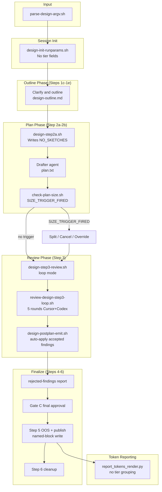

## Architecture Diagram

```mermaid
flowchart TD
    subgraph input["Input"]
        ARGV["parse-design-argv.sh"]
    end

    subgraph init["Session Init"]
        PARAMS["design-init-runparams.sh\nNo tier fields"]
    end

    subgraph outline["Outline Phase (Steps 1c-1e)"]
        CLR["Clarify and outline\ndesign-outline.md"]
    end

    subgraph plan["Plan Phase (Step 2a-2b)"]
        STEP2A["design-step2a.sh\nWrites NO_SKETCHES"]
        DRAFT["Drafter agent\nplan.txt"]
        SIZE["check-plan-size.sh\nSIZE_TRIGGER_FIRED"]
    end

    subgraph review["Review Phase (Step 3)"]
        REV["design-step3-review.sh\nloop mode"]
        LOOP["review-design-step3-loop.sh\n5 rounds Cursor+Codex"]
        POSTPLAN["design-postplan-emit.sh\nauto-apply accepted findings"]
    end

    subgraph report_tokens["Token Reporting"]
        RPTR["report_tokens_render.py\nno tier grouping"]
    end

    subgraph finalize["Finalize (Steps 4-6)"]
        REJF["rejected-findings report"]
        GATEC["Gate C final approval"]
        PUBLISH["Step 5 OOS + publish\nnamed-block write"]
        CLEAN["Step 6 cleanup"]
    end

    ARGV --> PARAMS
    PARAMS --> CLR
    CLR --> STEP2A
    STEP2A --> DRAFT
    DRAFT --> SIZE
    SIZE -->|no trigger| REV
    SIZE -->|SIZE_TRIGGER_FIRED| BRAKES["Split / Cancel / Override"]
    BRAKES --> REV
    REV --> LOOP
    LOOP --> POSTPLAN
    POSTPLAN --> REJF
    REJF --> GATEC
    GATEC --> PUBLISH
    PUBLISH --> CLEAN
    PUBLISH --> RPTR
```
