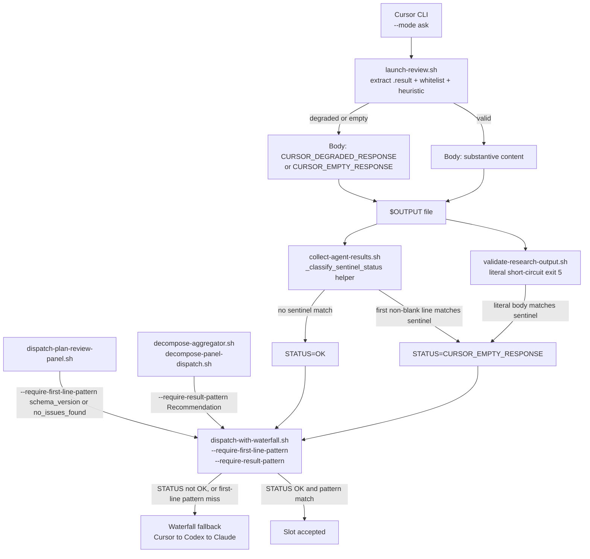

## Architecture Diagram

```mermaid
flowchart TD
    Cursor[Cursor CLI<br/>--mode ask]
    Launcher[launch-review.sh<br/>extract .result + whitelist + heuristic]
    Output[$OUTPUT file]
    Sentinel[Body: CURSOR_DEGRADED_RESPONSE<br/>or CURSOR_EMPTY_RESPONSE]
    Content[Body: substantive content]

    Collector[collect-agent-results.sh<br/>_classify_sentinel_status helper]
    Validator[validate-research-output.sh<br/>literal short-circuit exit 5]

    Dispatch[dispatch-with-waterfall.sh<br/>--require-first-line-pattern<br/>--require-result-pattern]
    PlanPanel[dispatch-plan-review-panel.sh]
    Decompose[decompose-aggregator.sh<br/>decompose-panel-dispatch.sh]

    StatusOK[STATUS=OK]
    StatusFail[STATUS=CURSOR_EMPTY_RESPONSE]
    Fallback[Waterfall fallback<br/>Cursor to Codex to Claude]
    Accepted[Slot accepted]

    Cursor --> Launcher
    Launcher -->|degraded or empty| Sentinel
    Launcher -->|valid| Content
    Sentinel --> Output
    Content --> Output

    Output --> Collector
    Output --> Validator

    Collector -->|first non-blank line matches sentinel| StatusFail
    Collector -->|no sentinel match| StatusOK
    Validator -->|literal body matches sentinel| StatusFail

    PlanPanel -->|--require-first-line-pattern schema_version or no_issues_found| Dispatch
    Decompose -->|--require-result-pattern Recommendation| Dispatch

    StatusOK --> Dispatch
    StatusFail --> Dispatch

    Dispatch -->|STATUS not OK, or first-line pattern miss| Fallback
    Dispatch -->|STATUS OK and pattern match| Accepted
```
