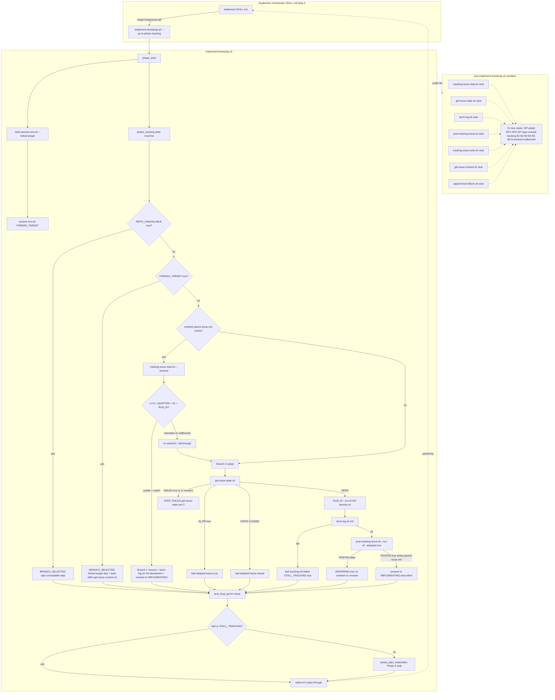

## Architecture Diagram

```mermaid
flowchart TD
    subgraph orch["/implement orchestrator SKILL.md Step 0"]
        SKILL[implement SKILL.md] -->|single foreground call| BOOT[implement-bootstrap.sh --up-to-phase tracking]
    end

    subgraph boot["implement-bootstrap.sh"]
        BOOT --> INFRA[phase_infra]
        INFRA --> WSE[write-session-env.sh --forked-target]
        WSE --> SENVFILE[session-env.sh FORKED_TARGET]
        INFRA --> TRACK[phase_tracking state machine]

        TRACK --> CARVE1{REPO_UNAVAILABLE true?}
        CARVE1 -->|yes| SKIPRU[BRANCH_SELECTED repo-unavailable-skip]
        CARVE1 -->|no| CARVE2{FORKED_TARGET true?}
        CARVE2 -->|yes| SKIPFT[BRANCH_SELECTED forked-target-skip + best-effort get-issue-context.sh]
        CARVE2 -->|no| B1CHK{sentinel parent-issue.md exists?}

        B1CHK -->|yes| B1READ[tracking-issue-read.sh --sentinel]
        B1READ --> B1USABLE{rc=0 + ADOPTED + ID + RUN_ID?}
        B1USABLE -->|usable + match| B1RESUME[Branch 1 resume + larch-log.sh init idempotent + rename to IMPLEMENTING]
        B1USABLE -->|mismatch or malformed| B1CLEAR[rm sentinel + fall through]
        B1CHK -->|no| B2START[Branch 2 adopt]
        B1CLEAR --> B2START

        B2START --> GIS[get-issue-state.sh]
        GIS -->|FAILED true or rc nonzero| EXIT2[STEP_FAILED get-issue-state exit 2]
        GIS -->|IS_PR true| BAILPR[bail adopted-issue-is-pr]
        GIS -->|STATE CLOSED| BAILCLOSED[bail adopted-issue-closed]
        GIS -->|OPEN| RUNID[RUN_ID --run-id OR session-id]
        RUNID --> LARCHINIT[larch-log.sh init]
        LARCHINIT -->|fail| STALL[bail tracking-init-failed STALL_TRACKING true]
        LARCHINIT -->|ok| POST[post-tracking-issue.sh --run-id --adopted true]
        POST -->|POSTED false| DEFER[DEFERRED true no sentinel no rename]
        POST -->|POSTED true writes parent-issue.md| RENAME[rename to IMPLEMENTING best-effort]

        SKIPRU --> TAIL[emit_final_tail KV block]
        SKIPFT --> TAIL
        B1RESUME --> TAIL
        BAILPR --> TAIL
        BAILCLOSED --> TAIL
        STALL --> TAIL
        DEFER --> TAIL
        RENAME --> TAIL

        TAIL --> GUARD{bail or STALL_TRACKING?}
        GUARD -->|yes| EMIT[stdout KV pass-through]
        GUARD -->|no| PHASE3[phase_plan_materialize Phase 3 stub]
        PHASE3 --> EMIT
    end

    subgraph harness["test-implement-bootstrap.sh sandbox"]
        STUB1[tracking-issue-read.sh stub]
        STUB2[get-issue-state.sh stub]
        STUB3[larch-log.sh stub]
        STUB4[post-tracking-issue.sh stub]
        STUB5[tracking-issue-write.sh stub]
        STUB6[get-issue-context.sh stub]
        STUB7[append-tool-failure.sh stub]
        STUB1 -.-> CASES[11 new cases: GP-adopt GP2 GP3 GP-repo-unavail-tracking B1 B2 B3 B4 B5 B6 B-sentinel-malformed]
        STUB2 -.-> CASES
        STUB3 -.-> CASES
        STUB4 -.-> CASES
        STUB5 -.-> CASES
        STUB6 -.-> CASES
        STUB7 -.-> CASES
    end

    EMIT -.parsed by.-> SKILL
    boot -.under test by.-> harness
```
