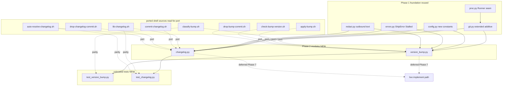

## Architecture Diagram

```mermaid
graph TD
    subgraph seam["Phase 1 foundation reused"]
        PROC["proc.py Runner seam"]
        GIT["git.py extended additive"]
        CFG["config.py new constants"]
        ERR["errors.py ShipError Stalled"]
        RED["redact.py outbound text"]
    end

    subgraph phase2["Phase 2 modules NEW"]
        VB["version_bump.py"]
        CL["changelog.py"]
    end

    subgraph tests["colocated tests NEW"]
        TVB["test_version_bump.py"]
        TCL["test_changelog.py"]
    end

    subgraph sources["ported shell sources read for port"]
        S1["classify-bump.sh"]
        S2["apply-bump.sh"]
        S3["check-bump-version.sh"]
        S4["drop-bump-commit.sh"]
        S5["lib-changelog.sh"]
        S6["commit-changelog.sh"]
        S7["drop-changelog-commit.sh"]
        S8["auto-resolve-changelog.sh"]
    end

    PROC --> GIT
    GIT --> VB
    GIT --> CL
    CFG --> VB
    CFG --> CL
    ERR --> VB
    ERR --> CL
    RED --> VB
    RED --> CL

    S1 -.port.-> VB
    S2 -.port.-> VB
    S3 -.port.-> VB
    S4 -.port.-> VB
    S5 -.port.-> CL
    S6 -.port.-> CL
    S7 -.port.-> CL
    S8 -.port.-> CL

    VB --> TVB
    CL --> TCL
    S1 -.parity.-> TVB
    S5 -.parity.-> TCL
    S8 -.parity.-> TCL

    LIVE["live implement path"]
    VB -.deferred Phase 7.-> LIVE
    CL -.deferred Phase 7.-> LIVE
```
