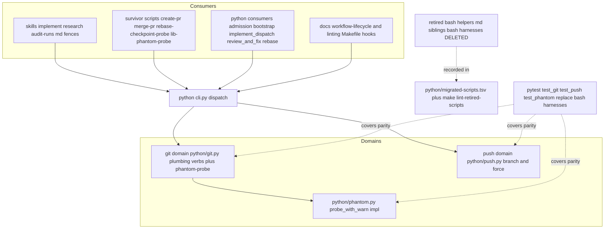

## Architecture Diagram

```mermaid
flowchart TD
    subgraph Consumers
        SK[skills implement research audit-runs md fences]
        SV[survivor scripts create-pr merge-pr rebase-checkpoint-probe lib-phantom-probe]
        PY[python consumers admission bootstrap implement_dispatch review_and_fix rebase]
        DOCS[docs workflow-lifecycle and linting Makefile hooks]
    end

    CLI[python cli.py dispatch]

    subgraph Domains
        GIT[git domain python/git.py plumbing verbs plus phantom-probe]
        PUSH[push domain python/push.py branch and force]
        PH[python/phantom.py probe_with_warn impl]
    end

    BASH[retired bash helpers md siblings bash harnesses DELETED]
    MAN[python/migrated-scripts.tsv plus make lint-retired-scripts]
    PYT[pytest test_git test_push test_phantom replace bash harnesses]

    SK --> CLI
    SV --> CLI
    PY --> CLI
    DOCS --> CLI
    CLI --> GIT
    CLI --> PUSH
    GIT --> PH
    BASH -.recorded in.-> MAN
    PYT -.covers parity.-> GIT
    PYT -.covers parity.-> PUSH
    PYT -.covers parity.-> PH
```
