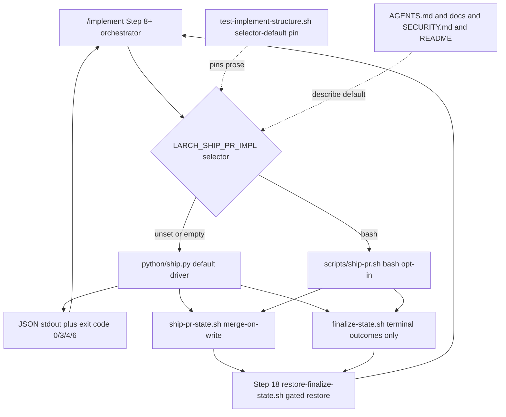

## Architecture Diagram

```mermaid
graph TD
    IMPL["/implement Step 8+ orchestrator"]
    SEL{"LARCH_SHIP_PR_IMPL selector"}
    PY["python/ship.py default driver"]
    BASH["scripts/ship-pr.sh bash opt-in"]
    JSON["JSON stdout plus exit code 0/3/4/6"]
    STATE["ship-pr-state.sh merge-on-write"]
    FIN["finalize-state.sh terminal outcomes only"]
    REST["Step 18 restore-finalize-state.sh gated restore"]
    PIN["test-implement-structure.sh selector-default pin"]
    DOCS["AGENTS.md and docs and SECURITY.md and README"]

    IMPL --> SEL
    SEL -->|unset or empty| PY
    SEL -->|bash| BASH
    PY --> JSON
    JSON --> IMPL
    PY --> STATE
    PY --> FIN
    BASH --> STATE
    BASH --> FIN
    STATE --> REST
    FIN --> REST
    REST --> IMPL
    PIN -.->|pins prose| SEL
    DOCS -.->|describe default| SEL
```
