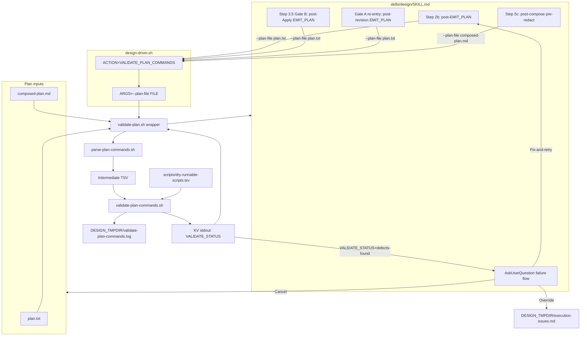

## Architecture Diagram

```mermaid
flowchart TD
  subgraph SKILL["skills/design/SKILL.md"]
    S2b["Step 2b: post-EMIT_PLAN"]
    SGB["Step 3.5 Gate B: post-Apply EMIT_PLAN"]
    SAR["Gate A re-entry: post-revision EMIT_PLAN"]
    S5c["Step 5c: post-compose pre-redact"]
    SAQ["AskUserQuestion failure flow"]
  end

  subgraph DRIVER["design-driver.sh"]
    DACT["ACTION=VALIDATE_PLAN_COMMANDS"]
    DARGS["ARGS=--plan-file FILE"]
  end

  WRAP["validate-plan.sh wrapper"]
  PARSE["parse-plan-commands.sh"]
  VAL["validate-plan-commands.sh"]

  subgraph INPUTS["Plan inputs"]
    PTXT[plan.txt]
    CPMD[composed-plan.md]
  end

  TSV["Intermediate TSV"]
  REG[scripts/dry-runnable-scripts.tsv]
  LOG["DESIGN_TMPDIR/validate-plan-commands.log"]
  KV["KV stdout: VALIDATE_STATUS"]
  EI["DESIGN_TMPDIR/execution-issues.md"]

  S2b -->|--plan-file plan.txt| DACT
  SGB -->|--plan-file plan.txt| DACT
  SAR -->|--plan-file plan.txt| DACT
  S5c -->|--plan-file composed-plan.md| DACT
  DACT --> DARGS --> WRAP

  PTXT --> WRAP
  CPMD --> WRAP

  WRAP --> PARSE
  PARSE --> TSV
  TSV --> VAL
  REG --> VAL
  VAL --> LOG
  VAL --> KV
  KV --> WRAP
  WRAP --> SKILL

  KV -->|VALIDATE_STATUS=defects-found| SAQ
  SAQ -->|Fix-and-retry| S2b
  SAQ -->|Override| EI
  SAQ -->|Cancel| INPUTS
```
