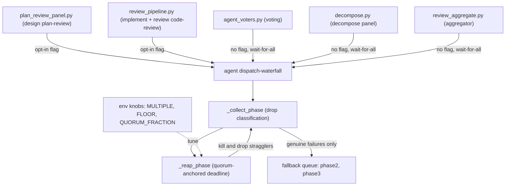

## Architecture Diagram

```mermaid
graph TD
    PR["plan_review_panel.py (design plan-review)"]
    RP["review_pipeline.py (implement + review code-review)"]
    VOT["agent_voters.py (voting)"]
    DEC["decompose.py (decompose panel)"]
    AGG["review_aggregate.py (aggregator)"]
    WF["agent dispatch-waterfall"]
    COLLECT["_collect_phase (drop classification)"]
    REAP["_reap_phase (quorum-anchored deadline)"]
    ENV["env knobs: MULTIPLE, FLOOR, QUORUM_FRACTION"]
    FB["fallback queue: phase2, phase3"]

    PR -->|"opt-in flag"| WF
    RP -->|"opt-in flag"| WF
    VOT -->|"no flag, wait-for-all"| WF
    DEC -->|"no flag, wait-for-all"| WF
    AGG -->|"no flag, wait-for-all"| WF
    WF --> COLLECT
    COLLECT --> REAP
    ENV -.->|"tune"| REAP
    REAP -->|"kill and drop stragglers"| COLLECT
    COLLECT -->|"genuine failures only"| FB
```
