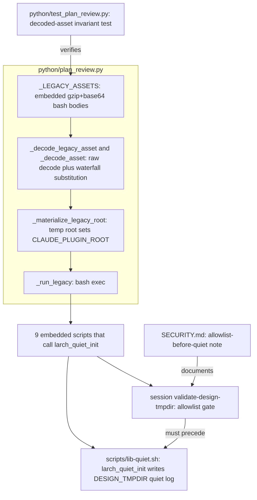

## Architecture Diagram

```mermaid
graph TD
    subgraph PR["python/plan_review.py"]
        LA["_LEGACY_ASSETS: embedded gzip+base64 bash bodies"]
        DEC["_decode_legacy_asset and _decode_asset: raw decode plus waterfall substitution"]
        MAT["_materialize_legacy_root: temp root sets CLAUDE_PLUGIN_ROOT"]
        RUN["_run_legacy: bash exec"]
    end

    ES["9 embedded scripts that call larch_quiet_init"]
    VAL["session validate-design-tmpdir: allowlist gate"]
    QUIET["scripts/lib-quiet.sh: larch_quiet_init writes DESIGN_TMPDIR quiet log"]

    TEST["python/test_plan_review.py: decoded-asset invariant test"]
    SEC["SECURITY.md: allowlist-before-quiet note"]

    LA --> DEC --> MAT --> RUN --> ES
    ES --> VAL
    ES --> QUIET
    VAL -->|must precede| QUIET
    TEST -->|verifies| LA
    SEC -->|documents| VAL
```
