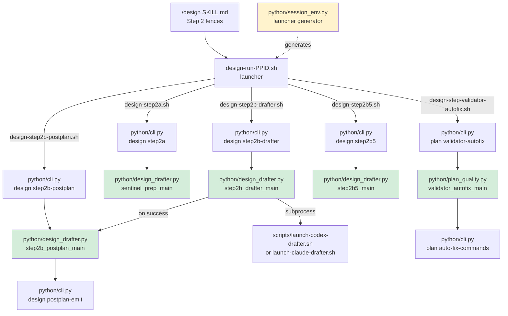

## Architecture Diagram

```mermaid
graph TD
    SKILL["/design SKILL.md<br/>Step 2 fences"] --> LAUNCHER["design-run-PPID.sh<br/>launcher"]

    LAUNCHER -->|"design-step2a.sh"| CLI_STEP2A["python/cli.py<br/>design step2a"]
    LAUNCHER -->|"design-step2b-drafter.sh"| CLI_DRAFTER["python/cli.py<br/>design step2b-drafter"]
    LAUNCHER -->|"design-step2b-postplan.sh"| CLI_POSTPLAN["python/cli.py<br/>design step2b-postplan"]
    LAUNCHER -->|"design-step2b5.sh"| CLI_STEP2B5["python/cli.py<br/>design step2b5"]
    LAUNCHER -->|"design-step-validator-autofix.sh"| CLI_AUTOFIX["python/cli.py<br/>plan validator-autofix"]

    CLI_STEP2A --> DRAFTER_PY["python/design_drafter.py<br/>sentinel_prep_main"]
    CLI_DRAFTER --> DRAFTER_PY2["python/design_drafter.py<br/>step2b_drafter_main"]
    CLI_POSTPLAN --> DRAFTER_PY3["python/design_drafter.py<br/>step2b_postplan_main"]
    CLI_STEP2B5 --> DRAFTER_PY4["python/design_drafter.py<br/>step2b5_main"]
    CLI_AUTOFIX --> QUALITY_PY["python/plan_quality.py<br/>validator_autofix_main"]

    DRAFTER_PY2 -->|"subprocess"| CODEX_LAUNCHER["scripts/launch-codex-drafter.sh<br/>or launch-claude-drafter.sh"]
    DRAFTER_PY2 -->|"on success"| DRAFTER_PY3
    DRAFTER_PY3 --> POSTPLAN_CLI["python/cli.py<br/>design postplan-emit"]
    QUALITY_PY --> AUTOFIX_CLI["python/cli.py<br/>plan auto-fix-commands"]

    SESSION_ENV["python/session_env.py<br/>launcher generator"] -.->|"generates"| LAUNCHER

    style DRAFTER_PY fill:#d4edda
    style DRAFTER_PY2 fill:#d4edda
    style DRAFTER_PY3 fill:#d4edda
    style DRAFTER_PY4 fill:#d4edda
    style QUALITY_PY fill:#d4edda
    style SESSION_ENV fill:#fff3cd
```
