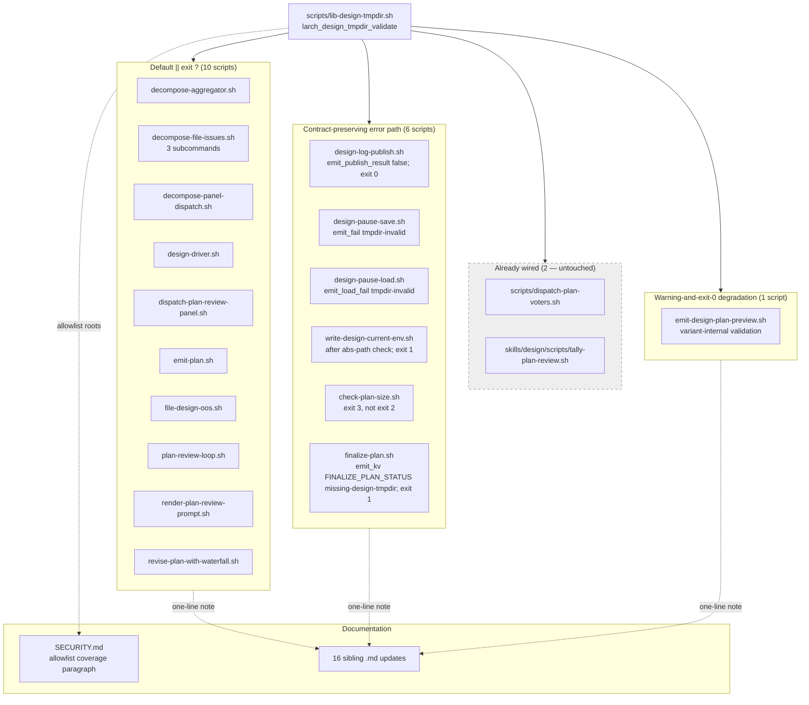

## Architecture Diagram

```mermaid
graph TD
  LIB[scripts/lib-design-tmpdir.sh<br/>larch_design_tmpdir_validate]

  subgraph WIRED["Already wired (2 — untouched)"]
    DPV[scripts/dispatch-plan-voters.sh]
    TPR[skills/design/scripts/tally-plan-review.sh]
  end

  subgraph DEFAULT["Default || exit ? (10 scripts)"]
    DA[decompose-aggregator.sh]
    DFI[decompose-file-issues.sh<br/>3 subcommands]
    DPD[decompose-panel-dispatch.sh]
    DD[design-driver.sh]
    DPRP[dispatch-plan-review-panel.sh]
    EP[emit-plan.sh]
    FDO[file-design-oos.sh]
    PRL[plan-review-loop.sh]
    RPRP[render-plan-review-prompt.sh]
    RPWW[revise-plan-with-waterfall.sh]
  end

  subgraph CONTRACT["Contract-preserving error path (6 scripts)"]
    DLP[design-log-publish.sh<br/>emit_publish_result false; exit 0]
    DPS[design-pause-save.sh<br/>emit_fail tmpdir-invalid]
    DPL[design-pause-load.sh<br/>emit_load_fail tmpdir-invalid]
    WDCE[write-design-current-env.sh<br/>after abs-path check; exit 1]
    CPS[check-plan-size.sh<br/>exit 3, not exit 2]
    FP[finalize-plan.sh<br/>emit_kv FINALIZE_PLAN_STATUS missing-design-tmpdir; exit 1]
  end

  subgraph DEGRADE["Warning-and-exit-0 degradation (1 script)"]
    EDPP[emit-design-plan-preview.sh<br/>variant-internal validation]
  end

  subgraph DOCS["Documentation"]
    SEC[SECURITY.md<br/>allowlist coverage paragraph]
    MD[16 sibling .md updates]
  end

  LIB --> WIRED
  LIB --> DEFAULT
  LIB --> CONTRACT
  LIB --> DEGRADE
  DEFAULT -. one-line note .-> MD
  CONTRACT -. one-line note .-> MD
  DEGRADE -. one-line note .-> MD
  LIB -. allowlist roots .-> SEC

  classDef untouched fill:#eee,stroke:#888,stroke-dasharray:5 5;
  class WIRED untouched;
```
