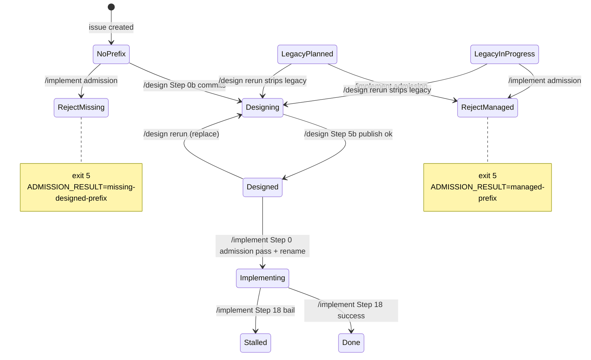
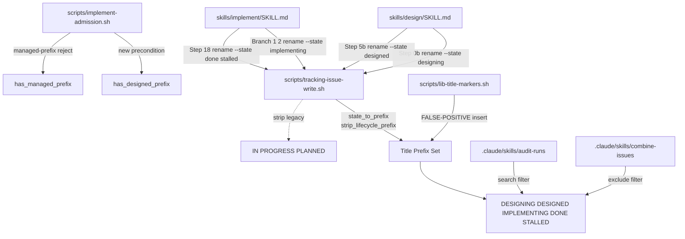

## Architecture Diagram

```mermaid
stateDiagram-v2
    [*] --> NoPrefix: issue created
    NoPrefix --> Designing: /design Step 0b commits
    Designing --> Designed: /design Step 5b publish ok
    Designed --> Implementing: /implement Step 0 admission pass + rename
    Implementing --> Done: /implement Step 18 success
    Implementing --> Stalled: /implement Step 18 bail
    Designed --> Designing: /design rerun (replace)
    NoPrefix --> RejectMissing: /implement admission
    LegacyPlanned --> RejectManaged: /implement admission
    LegacyInProgress --> RejectManaged: /implement admission
    LegacyPlanned --> Designing: /design rerun strips legacy
    LegacyInProgress --> Designing: /design rerun strips legacy

    note right of RejectMissing
        exit 5
        ADMISSION_RESULT=missing-designed-prefix
    end note

    note right of RejectManaged
        exit 5
        ADMISSION_RESULT=managed-prefix
    end note
```

```mermaid
graph TD
    A[scripts/tracking-issue-write.sh] -->|state_to_prefix<br/>strip_lifecycle_prefix| B[Title Prefix Set]
    B --> C[DESIGNING DESIGNED IMPLEMENTING DONE STALLED]
    A -.->|strip legacy| L[IN PROGRESS PLANNED]

    D[skills/design/SKILL.md] -->|Step 0b rename --state designing| A
    D -->|Step 5b rename --state designed| A

    E[skills/implement/SKILL.md] -->|Branch 1 2 rename --state implementing| A
    E -->|Step 18 rename --state done stalled| A

    F[scripts/implement-admission.sh] -->|new precondition| G[has_designed_prefix]
    F -->|managed-prefix reject| H[has_managed_prefix]

    I[scripts/lib-title-markers.sh] -->|FALSE-POSITIVE insert| B

    J[.claude/skills/audit-runs] -->|search filter| C
    K[.claude/skills/combine-issues] -->|exclude filter| C
```
