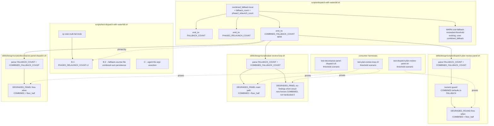

## Architecture Diagram

```mermaid
flowchart TD
    subgraph waterfall["scripts/dispatch-with-waterfall.sh"]
        W1["combined_fallback local<br/>= fallback_count + phase2_relaunch_count"]
        W2["emit_kv FALLBACK_COUNT"]
        W3["emit_kv PHASE2_RELAUNCH_COUNT"]
        W4["emit_kv COMBINED_FALLBACK_COUNT<br/>NEW"]
        W5["WARN cost-fallback-exceeded-threshold<br/>existing, uses combined_fallback"]
        W1 --> W2
        W1 --> W3
        W1 --> W4
        W1 --> W5
    end

    subgraph plan_panel["skills/design/scripts/dispatch-plan-review-panel.sh"]
        P1["parse FALLBACK_COUNT + COMBINED_FALLBACK_COUNT"]
        P2["numeric-guard: COMBINED defaults to FALLBACK"]
        P3["DEGRADED_ROUND fires when<br/>COMBINED > floor_half"]
        P1 --> P2 --> P3
    end

    subgraph loop["skills/design/scripts/plan-review-loop.sh"]
        L1["parse FALLBACK_COUNT + COMBINED_FALLBACK_COUNT"]
        L2["DEGRADED_PANEL main path<br/>COMBINED > floor_half"]
        L3["DEGRADED_PANEL no-findings short-circuit<br/>now honors COMBINED, not hardcoded 0"]
        L1 --> L2
        L1 --> L3
    end

    subgraph decompose["skills/design/scripts/decompose-panel-dispatch.sh"]
        D1["parse FALLBACK_COUNT + COMBINED_FALLBACK_COUNT"]
        D2["DEGRADED_PANEL fires when<br/>COMBINED > floor_half"]
        D1 --> D2
    end

    subgraph harness["scripts/test-dispatch-with-waterfall.sh"]
        H1["cp stub multi-fail knob"]
        H2["B-1: PHASE2_RELAUNCH_COUNT=2"]
        H3["B-2: --fallback-counter-file<br/>combined-sum persistence"]
        H4["C: --agent-file argv assertion"]
        H1 --> H2
    end

    subgraph consumer_harness["consumer harnesses"]
        CH1["test-plan-review-loop.sh<br/>threshold scenario"]
        CH2["test-dispatch-plan-review-panel.sh<br/>threshold scenario"]
        CH3["test-decompose-panel-dispatch.sh<br/>threshold scenario"]
    end

    W4 --> P1
    W4 --> L1
    W4 --> D1
    W4 -.pinned by.-> H2
    CH1 -.proves.-> L2
    CH1 -.proves.-> L3
    CH2 -.proves.-> P3
    CH3 -.proves.-> D2
```
