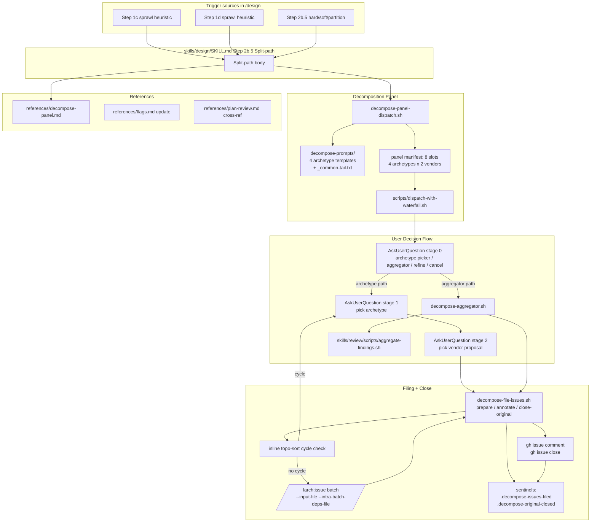

## Architecture Diagram

```mermaid
graph TD
    subgraph TriggerSites["Trigger sources in /design"]
        T1[Step 1c sprawl heuristic]
        T2[Step 1d sprawl heuristic]
        T3[Step 2b.5 hard/soft/partition]
    end

    subgraph SKILL["skills/design/SKILL.md Step 2b.5 Split-path"]
        SP[Split-path body]
    end

    subgraph PanelLayer["Decomposition Panel"]
        DPD[decompose-panel-dispatch.sh]
        Prompts[decompose-prompts/<br/>4 archetype templates<br/>+ _common-tail.txt]
        DWW[scripts/dispatch-with-waterfall.sh]
        DPM[panel manifest: 8 slots<br/>4 archetypes x 2 vendors]
    end

    subgraph DecisionLayer["User Decision Flow"]
        Q0[AskUserQuestion stage 0<br/>archetype picker / aggregator / refine / cancel]
        Q1[AskUserQuestion stage 1<br/>pick archetype]
        Q2[AskUserQuestion stage 2<br/>pick vendor proposal]
        Agg[decompose-aggregator.sh]
        AF[skills/review/scripts/aggregate-findings.sh]
    end

    subgraph FilingLayer["Filing + Close"]
        DFI[decompose-file-issues.sh<br/>prepare / annotate / close-original]
        Cycle[inline topo-sort cycle check]
        LarchIssue[/larch:issue batch<br/>--input-file --intra-batch-deps-file/]
        GH[gh issue comment<br/>gh issue close]
        Sent[sentinels:<br/>.decompose-issues-filed<br/>.decompose-original-closed]
    end

    subgraph Refs["References"]
        DRef[references/decompose-panel.md]
        FRef[references/flags.md update]
        PRRef[references/plan-review.md cross-ref]
    end

    T1 --> SP
    T2 --> SP
    T3 --> SP
    SP --> DRef
    SP --> DPD
    DPD --> Prompts
    DPD --> DPM
    DPM --> DWW
    DWW --> Q0
    Q0 -->|archetype path| Q1
    Q1 --> Q2
    Q0 -->|aggregator path| Agg
    Agg --> AF
    Q2 --> DFI
    Agg --> DFI
    DFI --> Cycle
    Cycle -->|no cycle| LarchIssue
    Cycle -->|cycle| Q1
    LarchIssue --> DFI
    DFI --> GH
    DFI --> Sent
    GH --> Sent
```
