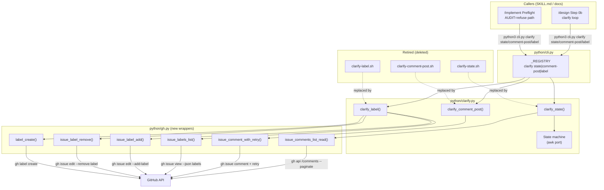

## Architecture Diagram

```mermaid
graph TD
    subgraph Callers["Callers (SKILL.md / docs)"]
        DS["/design Step 0b<br/>clarify loop"]
        IP["/implement Preflight<br/>AUDIT=refuse path"]
    end

    subgraph CLI["python/cli.py"]
        REG["_REGISTRY<br/>clarify state|comment-post|label"]
    end

    subgraph Module["python/clarify.py"]
        CS["clarify_state()"]
        CCP["clarify_comment_post()"]
        CL["clarify_label()"]
        SM["State machine<br/>(awk port)"]
    end

    subgraph GH["python/gh.py (new wrappers)"]
        ICL["issue_comments_list_read()"]
        ILL["issue_labels_list()"]
        ILA["issue_label_add()"]
        ILR["issue_label_remove()"]
        LC["label_create()"]
        ICR["issue_comment_with_retry()"]
    end

    subgraph Retired["Retired (deleted)"]
        SH1["clarify-state.sh"]
        SH2["clarify-comment-post.sh"]
        SH3["clarify-label.sh"]
    end

    DS -->|"python3 cli.py clarify state/comment-post/label"| REG
    IP -->|"python3 cli.py clarify state/comment-post/label"| REG

    REG --> CS
    REG --> CCP
    REG --> CL

    CS --> SM
    CS --> ICL
    CCP --> ICR
    CL --> ILL
    CL --> ILA
    CL --> ILR
    CL --> LC

    ICL -->|"gh api /comments --paginate"| GHA["GitHub API"]
    ICR -->|"gh issue comment + retry"| GHA
    ILL -->|"gh issue view --json labels"| GHA
    ILA -->|"gh issue edit --add-label"| GHA
    ILR -->|"gh issue edit --remove-label"| GHA
    LC -->|"gh label create"| GHA

    SH1 -.->|"replaced by"| CS
    SH2 -.->|"replaced by"| CCP
    SH3 -.->|"replaced by"| CL
```
