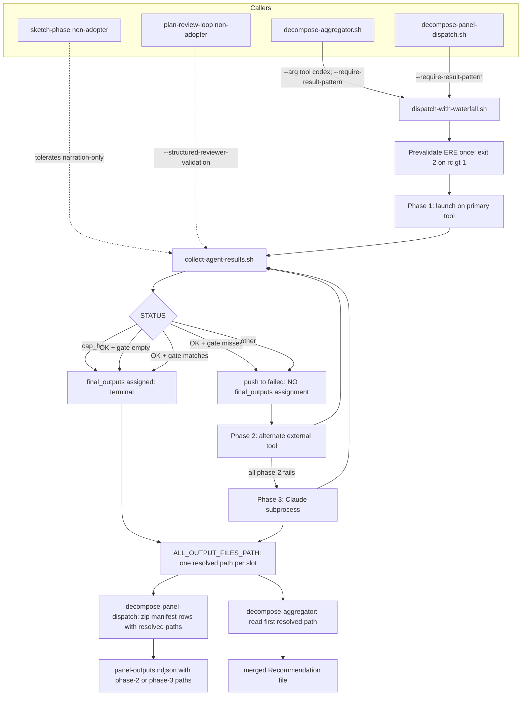

## Architecture Diagram

```mermaid
flowchart TD
    subgraph Callers
        A1[decompose-aggregator.sh]
        A2[decompose-panel-dispatch.sh]
        A3[sketch-phase non-adopter]
        A4[plan-review-loop non-adopter]
    end

    A1 -->|--arg tool codex; --require-result-pattern| D[dispatch-with-waterfall.sh]
    A2 -->|--require-result-pattern| D
    A3 -.->|tolerates narration-only| C1[collect-agent-results.sh]
    A4 -.->|--structured-reviewer-validation| C1

    D --> PV[Prevalidate ERE once: exit 2 on rc gt 1]
    PV --> P1[Phase 1: launch on primary tool]
    P1 --> C1
    C1 --> S{STATUS}
    S -->|cap_hit| F[final_outputs assigned: terminal]
    S -->|OK + gate empty| F
    S -->|OK + gate matches| F
    S -->|OK + gate misses| FL[push to failed: NO final_outputs assignment]
    S -->|other| FL

    FL --> P2[Phase 2: alternate external tool]
    P2 --> C1
    P2 -->|all phase-2 fails| P3[Phase 3: Claude subprocess]
    P3 --> C1

    F --> AOF[ALL_OUTPUT_FILES_PATH: one resolved path per slot]
    P3 --> AOF

    AOF --> RP[decompose-panel-dispatch: zip manifest rows with resolved paths]
    RP --> NDJ[panel-outputs.ndjson with phase-2 or phase-3 paths]
    AOF --> AGG[decompose-aggregator: read first resolved path]
    AGG --> MR[merged Recommendation file]
```
