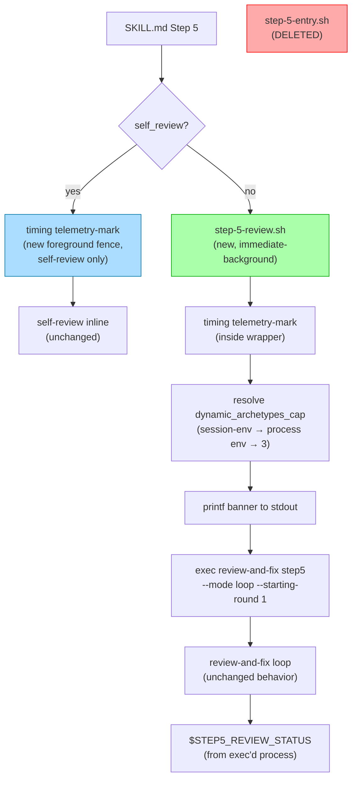

## Architecture Diagram

```mermaid
flowchart TD
    SKILL["SKILL.md Step 5"]
    SEL{self_review?}
    TM_SR["timing telemetry-mark\n(new foreground fence,\nself-review only)"]
    SR["self-review inline\n(unchanged)"]
    REV["step-5-review.sh\n(new, immediate-background)"]
    TM["timing telemetry-mark\n(inside wrapper)"]
    CAP["resolve dynamic_archetypes_cap\n(session-env → process env → 3)"]
    BAN["printf banner to stdout"]
    EXEC["exec review-and-fix step5\n--mode loop --starting-round 1"]
    LOOP["review-and-fix loop\n(unchanged behavior)"]
    RET["$STEP5_REVIEW_STATUS\n(from exec'd process)"]
    RETIRED["step-5-entry.sh\n(DELETED)"]

    SKILL --> SEL
    SEL -- yes --> TM_SR
    TM_SR --> SR
    SEL -- no --> REV
    REV --> TM
    TM --> CAP
    CAP --> BAN
    BAN --> EXEC
    EXEC --> LOOP
    LOOP --> RET

    style RETIRED fill:#faa,stroke:#f00
    style REV fill:#afa,stroke:#0a0
    style TM_SR fill:#adf,stroke:#07a
```
