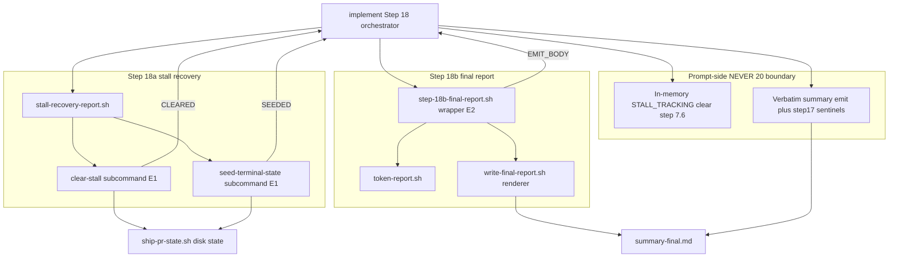

## Architecture Diagram

```mermaid
graph TD
    ORCH["implement Step 18 orchestrator"]
    STATE["ship-pr-state.sh disk state"]
    SUMMARY["summary-final.md"]

    subgraph PromptSide["Prompt-side NEVER 20 boundary"]
        INMEM["In-memory STALL_TRACKING clear step 7.6"]
        EMIT["Verbatim summary emit plus step17 sentinels"]
    end

    subgraph Step18a["Step 18a stall recovery"]
        SRR["stall-recovery-report.sh"]
        CLEAR["clear-stall subcommand E1"]
        SEED["seed-terminal-state subcommand E1"]
    end

    subgraph Step18b["Step 18b final report"]
        WRAP["step-18b-final-report.sh wrapper E2"]
        TOK["token-report.sh"]
        WFR["write-final-report.sh renderer"]
    end

    ORCH --> SRR
    SRR --> CLEAR
    SRR --> SEED
    CLEAR --> STATE
    SEED --> STATE
    CLEAR -->|CLEARED| ORCH
    SEED -->|SEEDED| ORCH
    ORCH --> INMEM
    ORCH --> WRAP
    WRAP --> TOK
    WRAP --> WFR
    WFR --> SUMMARY
    WRAP -->|EMIT_BODY| ORCH
    ORCH --> EMIT
    EMIT --> SUMMARY
```
