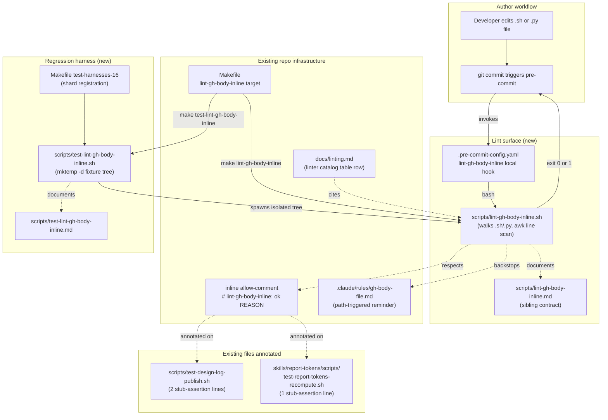

## Architecture Diagram

```mermaid
graph TD
    subgraph Author_Workflow["Author workflow"]
        DEV[Developer edits .sh or .py file]
        PCK[git commit triggers pre-commit]
    end

    subgraph Lint_Surface["Lint surface (new)"]
        HOOK[".pre-commit-config.yaml<br/>lint-gh-body-inline local hook"]
        SH["scripts/lint-gh-body-inline.sh<br/>(walks .sh/.py, awk line scan)"]
        DOCS["scripts/lint-gh-body-inline.md<br/>(sibling contract)"]
    end

    subgraph Existing_Infra["Existing repo infrastructure"]
        ALLOW["inline allow-comment<br/># lint-gh-body-inline: ok REASON"]
        RULE[".claude/rules/gh-body-file.md<br/>(path-triggered reminder)"]
        MK["Makefile<br/>lint-gh-body-inline target"]
        LDOC["docs/linting.md<br/>(linter catalog table row)"]
    end

    subgraph Harness["Regression harness (new)"]
        TEST["scripts/test-lint-gh-body-inline.sh<br/>(mktemp -d fixture tree)"]
        TDOC["scripts/test-lint-gh-body-inline.md"]
        SHARD["Makefile test-harnesses-16<br/>(shard registration)"]
    end

    subgraph Existing_Annotations["Existing files annotated"]
        ANN1["scripts/test-design-log-publish.sh<br/>(2 stub-assertion lines)"]
        ANN2["skills/report-tokens/scripts/<br/>test-report-tokens-recompute.sh<br/>(1 stub-assertion line)"]
    end

    DEV --> PCK
    PCK -->|invokes| HOOK
    HOOK -->|bash| SH
    SH -->|exit 0 or 1| PCK
    SH -.documents.-> DOCS
    SH -.respects.-> ALLOW
    ALLOW -.annotated on.-> ANN1
    ALLOW -.annotated on.-> ANN2
    SH -.backstops.-> RULE
    MK -->|make lint-gh-body-inline| SH
    MK -->|make test-lint-gh-body-inline| TEST
    SHARD --> TEST
    TEST -->|spawns isolated tree| SH
    TEST -.documents.-> TDOC
    LDOC -.cites.-> SH
```
