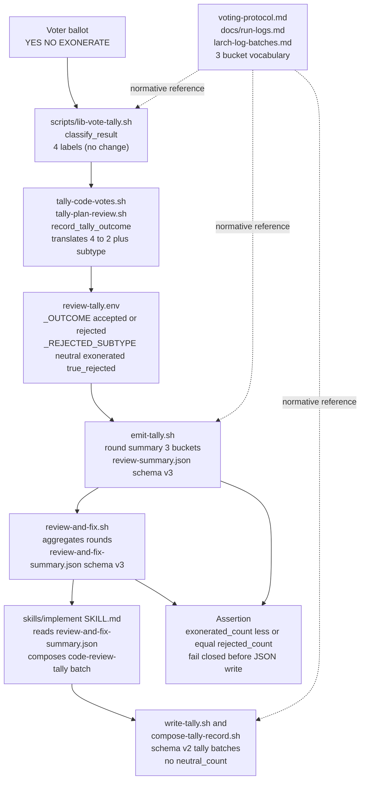

## Architecture Diagram

```mermaid
graph TD
    BALLOT["Voter ballot<br/>YES NO EXONERATE"]
    CLASSIFY["scripts/lib-vote-tally.sh<br/>classify_result<br/>4 labels (no change)"]
    RECORD["tally-code-votes.sh<br/>tally-plan-review.sh<br/>record_tally_outcome<br/>translates 4 to 2 plus subtype"]
    KV["review-tally.env<br/>_OUTCOME accepted or rejected<br/>_REJECTED_SUBTYPE neutral exonerated true_rejected"]
    EMIT["emit-tally.sh<br/>round summary 3 buckets<br/>review-summary.json schema v3"]
    RAF["review-and-fix.sh<br/>aggregates rounds<br/>review-and-fix-summary.json schema v3"]
    WTALLY["write-tally.sh and<br/>compose-tally-record.sh<br/>schema v2 tally batches<br/>no neutral_count"]
    IMPL["skills/implement SKILL.md<br/>reads review-and-fix-summary.json<br/>composes code-review-tally batch"]
    DOCS["voting-protocol.md<br/>docs/run-logs.md<br/>larch-log-batches.md<br/>3 bucket vocabulary"]
    INVARIANT["Assertion<br/>exonerated_count less or equal rejected_count<br/>fail closed before JSON write"]

    BALLOT --> CLASSIFY
    CLASSIFY --> RECORD
    RECORD --> KV
    KV --> EMIT
    EMIT --> RAF
    RAF --> IMPL
    IMPL --> WTALLY
    EMIT --> INVARIANT
    RAF --> INVARIANT
    DOCS -.normative reference.-> CLASSIFY
    DOCS -.normative reference.-> EMIT
    DOCS -.normative reference.-> WTALLY
```
