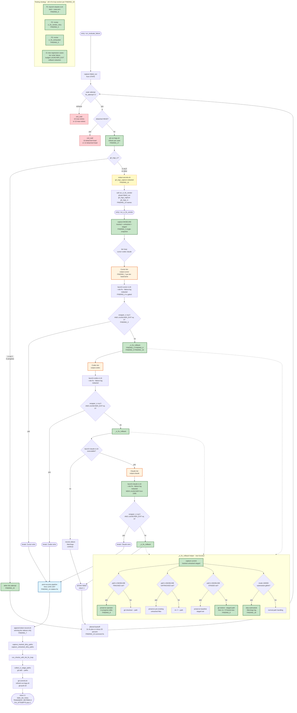

## Architecture Diagram

```mermaid
graph TD
    classDef phase fill:#e1f5fe,stroke:#01579b,stroke-width:2px
    classDef tier fill:#fff3e0,stroke:#e65100,stroke-width:2px
    classDef helper fill:#f3e5f5,stroke:#4a148c,stroke-width:1px
    classDef new fill:#c8e6c9,stroke:#1b5e20,stroke-width:2px
    classDef exit fill:#ffcdd2,stroke:#b71c1c,stroke-width:1px
    classDef redact fill:#fff9c4,stroke:#f57f17,stroke-width:1px

    EntryRE([entry: run_evaluate_failure]) --> CapBaseRE[capture failed_run<br/>from STATE]
    CapBaseRE --> OuterLoop{outer attempt<br/>fix_attempt lt 3}
    OuterLoop -->|exhaust| ExitStallMax[exit_stall<br/>10-max-retries<br/>or 12-max-retries]:::exit
    OuterLoop -->|yes| HeadGuard{detached HEAD?}
    HeadGuard -->|yes| ExitStallDH[exit_stall<br/>10-detached-head<br/>or 12-detached-head]:::exit
    HeadGuard -->|no| GhRunLogs[gh-run-logs.sh<br/>refresh per outer<br/>FINDING_17]:::new
    GhRunLogs --> RcCheck{gh_logs_rc?}
    RcCheck -->|rc eq 3<br/>in progress| Defer[defer this attempt<br/>FINDING_22]:::new
    Defer --> Backoff
    RcCheck -->|rc eq 0<br/>or other| Redact[redact-secrets.sh<br/>gh_logs_capture.redacted<br/>FINDING_11]:::redact
    Redact --> CallVendor[call run_ci_fix_vendor<br/>phase failed_run<br/>gh_logs_capture gh_logs_rc<br/>FINDING_13 names]

    CallVendor --> VendorEntry([entry: run_ci_fix_vendor])
    VendorEntry --> CapBaseV[capture BASELINE<br/>tracked + untracked + staged<br/>FINDING_2 single-snapshot]:::new
    CapBaseV --> TierLoop{tier loop:<br/>cursor codex claude}

    TierLoop --> CursorTier[Cursor tier<br/>output.cursor<br/>FINDING_7 per-tier basename]:::tier
    CursorTier --> CursorRun[launch-cursor-ci.sh<br/>--role fix --failure-log redacted<br/>FINDING_4 rc-gated]
    CursorRun --> CursorEval{wrapper_rc eq 0<br/>AND LAUNCHER_EXIT eq 0?<br/>FINDING_3}
    CursorEval -->|yes| WinCursor([break: Cursor wins])
    CursorEval -->|no| RollC[_ci_fix_rollback<br/>FINDING_2 FINDING_8<br/>FINDING_9 FINDING_18]:::new
    RollC --> CodexTier

    CodexTier[Codex tier<br/>output.codex]:::tier --> CodexRun[launch-codex-ci.sh<br/>--role fix --failure-log redacted]
    CodexRun --> CodexEval{wrapper_rc eq 0<br/>AND LAUNCHER_EXIT eq 0?}
    CodexEval -->|yes| WinCodex([break: Codex wins])
    CodexEval -->|no| RollX[_ci_fix_rollback]:::new
    RollX --> ClaudeGate{launch-claude-ci.sh<br/>executable?}
    ClaudeGate -->|no| WarnNo[record_failure<br/>Warnings<br/>continue]
    WarnNo --> TierFail
    ClaudeGate -->|yes| ClaudeTier[Claude tier<br/>output.claude]:::tier
    ClaudeTier --> ClaudeRun[launch-claude-ci.sh<br/>--role fix --failure-log redacted<br/>NEW LAUNCHER from 2395]:::new
    ClaudeRun --> ClaudeEval{wrapper_rc eq 0<br/>AND LAUNCHER_EXIT eq 0?}
    ClaudeEval -->|yes| WinClaude([break: Claude wins])
    ClaudeEval -->|no| RollK[_ci_fix_rollback]:::new
    RollK --> TierFail([all tiers failed<br/>return 1])

    WinCursor --> PostSuccess
    WinCodex --> PostSuccess
    WinClaude --> PostSuccess

    PostSuccess[post-success pipeline<br/>lines 1245-1307<br/>FINDING_14 citation fix]:::phase
    PostSuccess --> AppendToken[append-token-record.sh<br/>winning tier sidecar only<br/>FINDING_7]
    AppendToken --> CaptureDirty[capture_tracked_dirty_paths<br/>capture_untracked_dirty_paths]
    CaptureDirty --> LintFix[run_checks_with_lint_fix_loop]
    LintFix --> StagePaths[collect_ci_stage_paths<br/>git add -- paths]
    StagePaths --> CommitPush[git-commit.sh<br/>refresh-run-logs.sh<br/>git-push.sh]
    CommitPush --> SuccessOut([return 0:<br/>state_set_many<br/>TRANSIENT_RETRIES 0<br/>FIX_ATTEMPTS plus 1])

    TierFail --> Backoff[jittered backoff<br/>2s 4s plus or minus 25 percent<br/>FINDING_10 comment fix]
    Backoff --> OuterLoop

    subgraph RollbackSubgraph[_ci_fix_rollback helper - new function]
        direction TB
        RBStart[capture current<br/>tracked untracked staged]:::new
        RBStart --> RBTracked{path in BASELINE<br/>TRACKED set?}
        RBTracked -->|yes| RBSkipTracked[preserve operator<br/>in-progress edits<br/>FINDING_8]:::new
        RBTracked -->|no| RBCheckout[git checkout -- path]
        RBStart --> RBUntracked{path in BASELINE<br/>UNTRACKED set?}
        RBUntracked -->|yes| RBSkipUntracked[preserve pre-existing<br/>untracked files]
        RBUntracked -->|no| RBRm[rm -f -- path]
        RBStart --> RBStaged{path in BASELINE<br/>STAGED set?}
        RBStaged -->|yes| RBSkipStaged[preserve baseline<br/>staged set]
        RBStaged -->|no| RBRestoreStaged[git restore --staged path<br/>then rm -f if brand-new<br/>FINDING_9]:::new
        RBStart --> RBSubmod{mode 160000<br/>submodule gitlink?}
        RBSubmod -->|yes| RBSkipSub[skip submodule<br/>Warnings log<br/>FINDING_18]:::new
        RBSubmod -->|no| RBNormalPath[normal path handling]
    end

    RollC -.-> RollbackSubgraph
    RollX -.-> RollbackSubgraph
    RollK -.-> RollbackSubgraph

    subgraph TestSubgraph[Testing strategy - all in fix-loop section per FINDING_19]
        T1[P1: launch-claude-ci.sh<br/>stub + case-arm<br/>FINDING_6]:::new
        T2[P2: revise<br/>ci_fix_vendor_retry<br/>FINDING_5]:::new
        T3[P3: revise<br/>ci_fix_exhausted<br/>FINDING_5]:::new
        T4[21 new regression cases<br/>tier order failure<br/>budget LAUNCHER_EXIT<br/>rollback redaction]:::new
    end
```
