## Plan

# Plan — Fixes #2632: Extend run_ci_fix_vendor with Claude tier (3-tier waterfall + reduced outer budget)

**Blocked by #2395** (provides `scripts/launch-claude-ci.sh`, `--failure-log` argv on cursor/codex CI launchers, and the proven path-rollback pattern via `--` sentinel + quoted while-read loop). `/implement` must wait for #2395 to merge.

**Note on `run_recovery_waterfall` references (Gate B applied FINDING_1, FINDING_20)**: this plan inlines the exact rollback algorithm rather than relying on grep against the (post-#2395) `run_recovery_waterfall` symbol. The `_ci_fix_rollback` helper introduced in this PR is a self-contained shell function inside `scripts/ship-pr.sh` that does NOT depend on `run_recovery_waterfall`'s body. If `/implement` discovers that #2395 landed a more general `_rollback_paths`-style helper compatible with the contract below, it MAY refactor `_ci_fix_rollback` to call that helper as a one-line wrapper; otherwise the inlined algorithm stands.

## Files to modify

1. **`scripts/ship-pr.sh`** — replace the recovery loop body inside `run_ci_fix_vendor` (currently lines 1225-1244) with a 3-tier inline waterfall: Cursor → Codex → Claude, one attempt per tier; introduce a new `_ci_fix_rollback` helper function; thread a `gh_logs_capture` positional arg and a separate `gh_logs_rc` flag from `run_evaluate_failure`; reduce `_max_fix=5` to `_max_fix=3` in `run_evaluate_failure` (line 1337); update the adjacent comment (line 1334) and the jitter-ladder comment (lines 1353-1354); refresh `gh-run-logs.sh` at the start of each outer attempt; short-circuit on rc=3.

2. **`scripts/test-ship-pr.sh`** — extend the existing `fix-loop` section (do NOT create a `fix-loop-3tier` section per FINDING_19); add `launch-claude-ci.sh` to BOTH the shared `make_repo` `case` arm at lines 172-217 AND the duplicate fixture block at lines 2387-2406 (per FINDING_6); revise the existing `ci_fix_exhausted` test at lines 2440-2481 and the existing `ci_fix_vendor_retry` test at lines 2232-2287 for the new 3-tier / 3-outer math (per FINDING_5); add the new regression cases enumerated under "## Testing strategy" below.

3. **`scripts/ship-pr.md`** — update the retry-math sentence at line 69 (5→3 outer; 3-tier inner shape Cursor → Codex → Claude); align the staging sentence at lines 82-83 (already covered as OOS_1 follow-up; included here because the same paragraph block is edited); document `--failure-log` redaction expectation; document the rc=3 short-circuit behavior; add the worst-case math (3 outer × 3 tiers = 9 launcher calls per phase, down from 15 today).

4. **`SECURITY.md`** — add `--failure-log` (carrying `gh-run-logs.sh` captures) to the documented redaction-required surfaces; reference `scripts/redact-secrets.sh` as the gate (per FINDING_11). Add one sentence under whatever heading currently enumerates external-tool trust boundaries.

## Approach

**Delete the existing inner loop entirely** (per FINDING_15). The block `for vendor_attempt in 1 2 3; do … done` at `scripts/ship-pr.sh:1225-1244` is REMOVED, not nested under the new tier structure. The new 3-tier sequence REPLACES it.

### New inner shape — three tiers, one attempt each

```
# Conceptual shape (actual code uses per-tier helper invocations):
TIERS=(cursor codex claude)
for tier in "${TIERS[@]}"; do
    [ "$tier" = "claude" ] && [ ! -x "$SCRIPT_DIR/launch-claude-ci.sh" ] && {
        # Pre-#2395 baseline drift defense — record + continue, do not abort
        record_failure "$phase" "launch-claude-ci.sh unavailable" 1 "$fail_file" "Warnings"
        continue
    }
    output="$IMPLEMENT_TMPDIR/ci-fix-${phase}-${tier}-$(date +%s).out"  # per-tier basename (FINDING_7)
    fail_file=$(failure_capture_path "$phase")
    _failure_log_args=()
    if [ "$gh_logs_rc" -eq 0 ] && [ -s "$gh_logs_capture" ]; then
        _failure_log_args=(--failure-log "$gh_logs_capture_redacted")
    fi
    "$SCRIPT_DIR/launch-${tier}-ci.sh" --role fix --output "$output" --run-id "$run_id" \
        --repo "$(read_state REPO)" ${plan_args[@]+"${plan_args[@]}"} \
        "${_failure_log_args[@]}" --timeout 1800 > "$fail_file" 2>&1
    wrapper_rc=$?
    launcher_exit=$(awk -F= '/^LAUNCHER_EXIT=/ {print $2; exit}' "$fail_file")
    launcher_exit="${launcher_exit:-0}"
    if [ "$wrapper_rc" -eq 0 ] && [ "$launcher_exit" -eq 0 ]; then
        tool_label="launch-${tier}-ci.sh fix"
        break  # tier success → fall through to post-success at lines 1245-1307
    fi
    record_failure "$phase" "launch-${tier}-ci.sh fix (wrapper_rc=$wrapper_rc, launcher_exit=$launcher_exit)" "${launcher_exit:-$wrapper_rc}" "$fail_file" "CI Issues"
    _ci_fix_rollback "$phase"
done
[ "$wrapper_rc" -eq 0 ] && [ "${launcher_exit:-0}" -eq 0 ] || return 1
# Fall through to existing post-success pipeline at lines 1245-1307 (NOT 1244 — per FINDING_14)
```

**Tier success criterion (per FINDING_3)**: `wrapper_rc == 0 AND launcher_exit == 0`. The current `launch-cursor-ci.sh:193-196` and `launch-codex-ci.sh:175-178` emit `LAUNCHER_EXIT=<n>` on stdout and then `exit 0` for agent runtime failures (auth, timeout, model error). Parsing `LAUNCHER_EXIT` from the captured `fail_file` and gating tier success on its value prevents agent failures from being treated as tier success — which would let the cascade short-circuit on the first tier even when the agent failed, and then run commit/push after a broken fix. `wrapper_rc == 2` (validation failure) still surfaces directly via the rc branch.

**Per-tier output basename (per FINDING_7)**: each tier writes to `$output.${tier}` (e.g., `ci-fix-ci-initial-cursor-…out`, `…-codex-…out`, `…-claude-…out`). The token-record sidecar (`${output}.token-record`) is also per-tier; `append-token-record.sh` at line 1246 reads the WINNING tier's sidecar only (whichever tier broke out of the loop). No stale Cursor token data can be appended after a Codex/Claude success.

### gh-run-logs.sh integration (FINDING_4, FINDING_11, FINDING_17, FINDING_22)

`run_evaluate_failure` (current line 1330) calls `gh-run-logs.sh` and captures stdout to `$fail_file`. To make this usable as `--failure-log` content:

1. **Bind a dedicated local**: immediately after the `gh-run-logs.sh` call, assign `local gh_logs_capture="$fail_file"; local gh_logs_rc="$rc"` (per FINDING_13). Then clear `$fail_file` (`fail_file=""`) so the next `fail_file=$(failure_capture_path "$phase")` inside `run_ci_fix_vendor` does not collide.
2. **Refresh per outer attempt (per FINDING_17)**: move the `gh-run-logs.sh` invocation INSIDE the outer `while` loop, so each retry gets a fresh capture. Today's "once before the loop" pattern feeds stale logs to later outer retries when CI state has diverged. The extra API calls are bounded (max 3 calls × cost of `gh run view --log`).
3. **rc=3 short-circuit (per FINDING_22)**: when `gh_logs_rc -eq 3` ("run still in progress" per `gh-run-logs.sh:17-19`), skip the entire `run_ci_fix_vendor` invocation for this outer attempt. Let the existing jittered-backoff sleep at lines 1352-1360 fire, then re-check on the next outer iteration. CI may have finished by then. Pseudocode:

   ```
   while [ "$_fix_attempt" -lt "$_max_fix" ]; do
       # detached-HEAD guard (unchanged)
       fail_file=$(failure_capture_path "$phase")
       "$SCRIPT_DIR/gh-run-logs.sh" --run-id "$failed_run" --repo "$(read_state REPO)" > "$fail_file" 2>&1
       gh_logs_rc=$?
       gh_logs_capture="$fail_file"; fail_file=""
       if [ "$gh_logs_rc" -eq 3 ]; then
           printf 'ship-pr %s: CI still in progress (gh-run-logs rc=3); deferring vendor dispatch this attempt.\n' "$phase"
           # fall through to backoff + retry
       elif run_ci_fix_vendor "$phase" "$failed_run" "$gh_logs_capture" "$gh_logs_rc"; then
           state_set_many TRANSIENT_RETRIES 0 FIX_ATTEMPTS "$(( $(read_state FIX_ATTEMPTS) + 1 ))"
           return 0
       fi
       _fix_attempt=$(( _fix_attempt + 1 ))
       # jittered backoff (unchanged)
   done
   exit_stall ...
   ```

4. **`--failure-log` redaction (per FINDING_11)**: do NOT pass `$gh_logs_capture` directly. Pipe through `scripts/redact-secrets.sh` to a sibling redacted file, then forward THAT path. Pseudocode (executed inside `run_ci_fix_vendor` once, before the tier loop):

   ```
   gh_logs_capture_redacted=""
   if [ "$gh_logs_rc" -eq 0 ] && [ -s "$gh_logs_capture" ]; then
       gh_logs_capture_redacted="${gh_logs_capture}.redacted"
       "$SCRIPT_DIR/redact-secrets.sh" < "$gh_logs_capture" > "$gh_logs_capture_redacted" 2>/dev/null || gh_logs_capture_redacted=""
   fi
   # If redaction fails, omit --failure-log entirely (fail-closed for security)
   ```

5. **`--failure-log` guard correctness (per FINDING_4)**: the guard is now `[ "$gh_logs_rc" -eq 0 ] && [ -s "$gh_logs_capture_redacted" ]`. Forward `--failure-log` only when gh-run-logs returned rc=0 (real failure with usable logs), the redaction step succeeded, and the redacted file is non-empty. The header-only rc=3 and rc=1 cases naturally fail this gate.

### Inter-tier rollback — single function-entry baseline + `_ci_fix_rollback` helper (FINDING_2, FINDING_8, FINDING_9, FINDING_18, FINDING_20)

**Single baseline model (per FINDING_2)**: snapshot the tracked / untracked / staged-added state ONCE at `run_ci_fix_vendor` function entry, before Tier 1 runs. Every per-tier rollback delta is computed against this single baseline (NOT against the prior tier's state). This is conservative and avoids the contradictory dual-snapshot model in the original plan.

**`_ci_fix_rollback` helper (new function in `scripts/ship-pr.sh`, ~30 lines)**: encapsulates the rollback contract so each tier failure calls one line. Pseudocode:

```
_ci_fix_rollback() {
    local phase=$1
    local tracked_now untracked_now staged_now
    tracked_now=$(capture_tracked_dirty_paths)
    untracked_now=$(capture_untracked_dirty_paths)
    staged_now=$(git diff --name-only --cached 2>/dev/null || true)

    # Tier-introduced tracked changes: paths now-dirty that were NOT in baseline.
    # Note: if a path was already dirty at baseline, leave it alone (operator's work, per FINDING_8).
    local p
    while IFS= read -r p; do
        [ -z "$p" ] && continue
        # Skip submodule gitlinks (per FINDING_18 — submodule inner state is out of scope).
        if git ls-files --stage -- "$p" 2>/dev/null | grep -q '^160000 '; then
            printf 'ship-pr: _ci_fix_rollback: skipping submodule path %s (out of scope).\n' "$p"
            continue
        fi
        # Already dirty at baseline → preserve operator content (do NOT git checkout)
        if printf '%s\n' "$BASELINE_TRACKED" | grep -qFx -- "$p"; then
            continue
        fi
        # Net-new dirty since baseline → revert
        git checkout -- "$p" 2>/dev/null || true
    done < <(printf '%s\n' "$tracked_now")

    # Untracked-introduced-by-tier: paths now-present that were NOT in baseline.
    while IFS= read -r p; do
        [ -z "$p" ] && continue
        if printf '%s\n' "$BASELINE_UNTRACKED" | grep -qFx -- "$p"; then
            continue
        fi
        rm -f -- "$p" 2>/dev/null || true
    done < <(printf '%s\n' "$untracked_now")

    # Staged-added-by-tier (per FINDING_9): paths now-staged that were NOT in baseline staged set.
    # After `git restore --staged`, the path becomes either untracked-new or untracked-modified.
    # Combined with the rm-untracked loop above, this catches `git add <new_file>` from a failed tier.
    while IFS= read -r p; do
        [ -z "$p" ] && continue
        if printf '%s\n' "$BASELINE_STAGED" | grep -qFx -- "$p"; then
            continue
        fi
        git restore --staged -- "$p" 2>/dev/null || true
        # If the path is brand-new (didn't exist pre-tier), also rm it.
        if ! printf '%s\n' "$BASELINE_TRACKED" "$BASELINE_UNTRACKED" | grep -qFx -- "$p"; then
            rm -f -- "$p" 2>/dev/null || true
        fi
    done < <(printf '%s\n' "$staged_now")
}
```

Uses Bash 3.2-compatible constructs (`while IFS= read -r`, no `mapfile`/`local -n`/`&>>`). The `--` sentinel + quoted argument pattern prevents path injection in space/glob-containing filenames.

**Baseline capture at function entry**: before Tier 1 runs:

```
local BASELINE_TRACKED BASELINE_UNTRACKED BASELINE_STAGED
BASELINE_TRACKED=$(capture_tracked_dirty_paths)
BASELINE_UNTRACKED=$(capture_untracked_dirty_paths)
BASELINE_STAGED=$(git diff --name-only --cached 2>/dev/null || true)
```

**Pre-existing dirty content preservation (per FINDING_8)**: a path that appears in `BASELINE_TRACKED` (i.e., was already dirty when `run_ci_fix_vendor` was called) is NEVER reverted by `_ci_fix_rollback` — the operator's in-progress work is preserved. The trade-off: if a failed tier modified an already-dirty file, its edits remain in the file when the next tier runs. The next tier sees the operator's pre-existing dirt PLUS the failed tier's edits. This is the documented contract; tests pin it. Alternative (b) discussed by reviewers (fail-closed if dirty baseline exists) is rejected because operators commonly run `/implement` with partial scratch edits and forcing a clean baseline is too aggressive.

**Submodule exclusion (per FINDING_18)**: submodule gitlinks (`mode 160000`) are explicitly skipped by `_ci_fix_rollback`. A failed tier that modifies submodule inner state leaves that state intact for the next tier; this is a known limitation. Add a `Warnings`-category line so the operator sees it. Full submodule-aware rollback is out of scope for #2632.

### Outer-loop change (run_evaluate_failure)

- `local _max_fix=5 _fix_attempt` → `local _max_fix=3 _fix_attempt`.
- Comment at line 1334: `5 vendor+push attempts` → `3 outer attempts (3-tier inner waterfall = up to 9 launcher calls per phase, down from 15 today)`.
- Comment at lines 1353-1354: `Jittered backoff: 2s/4s/8s/16s ±25 %` → `Jittered backoff: 2s/4s ±25% (8s/16s ladder entries reserved for higher _max_fix values; unused at _max_fix=3)` (per FINDING_10).
- Detached-HEAD guard, `state_set_many TRANSIENT_RETRIES 0 FIX_ATTEMPTS …` success path, stall tokens `10-max-retries` / `12-max-retries`: unchanged.

### Signature change for `run_ci_fix_vendor` (FINDING_13)

Add two positional args: `local gh_logs_capture=$3 gh_logs_rc=$4` (NOT `gh_logs_fail_file` — that name collides with the function-internal `fail_file` reassignments). Call site in `run_evaluate_failure` (now line ~1347):

```
if run_ci_fix_vendor "$phase" "$failed_run" "$gh_logs_capture" "$gh_logs_rc"; then
```

The caller's `$gh_logs_capture` (bound right after `gh-run-logs.sh`) and callee's `$gh_logs_capture` (a `local`) are separate variables; no shared state.

## Edge cases

- **Claude binary missing but launcher present**: `launch-claude-ci.sh` should fail cleanly per #2395; the wrapper non-zero exit AND/OR `LAUNCHER_EXIT=<non-zero>` triggers `_ci_fix_rollback` and the outer loop continues.
- **Launcher script missing entirely** (e.g., pre-#2395 baseline drift): `[ -x "$SCRIPT_DIR/launch-claude-ci.sh" ]` guard skips Claude tier with `record_failure … "launch-claude-ci.sh unavailable" 1 … "Warnings"`. Function still returns 1 if Cursor+Codex both failed, and the outer loop continues.
- **gh-run-logs.sh rc=3 (CI in progress)**: skip the entire `run_ci_fix_vendor` invocation this outer attempt; fall through to backoff. The outer cap still applies (3 outer attempts means at most 3 deferrals before exit_stall). Test pins this behavior.
- **gh-run-logs.sh rc=0 but capture is header-only** (e.g., no failed-step logs available): `[ -s "$gh_logs_capture_redacted" ]` is true (header present) but the redacted text after secret removal may be empty. If `redact-secrets.sh` succeeded but produced an empty file, `gh_logs_capture_redacted` remains set and the guard passes (`[ -s … ]` checks size; an empty file fails this gate). Tests pin this branch.
- **Redaction failure**: `redact-secrets.sh` non-zero → `gh_logs_capture_redacted` cleared → `--failure-log` omitted. Fail-closed per security policy.
- **Identical PATH stubs of cursor and codex that both succeed**: ordering matters — Cursor wins because it runs first. Same as today.
- **Pre-existing tracked dirt at function entry**: preserved across all tier failures by `_ci_fix_rollback`'s baseline-aware logic. Failed-tier edits to those files DO remain (documented limitation, pinned by test).
- **Submodule modification by a tier**: skipped by `_ci_fix_rollback`'s `mode 160000` check; logged as Warnings; not restored.

## Failure modes

1. **Rollback leaves a path inconsistent state**. `_ci_fix_rollback` uses `git checkout --` for tracked-tier-introduced changes and `rm -f --` for untracked-tier-introduced files. If both run against the same path in unexpected order, OR if `BASELINE_*` capture missed something, the next tier sees partial state. Earliest signal: a regression test fixture where the post-rollback `git diff --name-only HEAD` is non-empty when the baseline was clean. Mitigation: the inline algorithm is byte-pinned by tests; do NOT inline-modify it during /implement; if #2395's helper is compatible, optionally swap to a one-line wrapper but keep the inline algorithm as the comment-as-spec reference.
2. **Reduced outer budget masks real flakes**. Dropping 5 → 3 means a flaky CI that needed 4 vendor attempts to converge now stalls. Earliest signal: `exit_stall 10-max-retries` / `12-max-retries` rate rises in production. Mitigation: the new attempt math (3 outer × 3 tiers = 9 launcher calls) is more diverse than today's 15-of-one-vendor; operators can manually re-run, and the OOS rejected alternative (keep `_max_fix=5`, add Claude as 4th tier) is documented as a known counter-proposal in `scripts/ship-pr.md`.
3. **Claude tier cost amplification**. Claude tier fires up to 3× per phase × multiple phases. Earliest signal: `larch-logs/implement/<RUN>/token-report.json` shows Claude token spike on phases like `ci-initial`. Mitigation: per-tier output basenames let token-report attribute spend cleanly; the outer-budget reduction 5 → 3 caps growth. Further cost controls belong to a follow-up issue.

## Testing strategy

All new cases live in the EXISTING `fix-loop` section of `scripts/test-ship-pr.sh` (per FINDING_19 — do NOT create `fix-loop-3tier`). The Makefile target `test-ship-pr-fix-loop` continues to cover them.

**Prerequisite changes to existing fixtures**:

P1. **Add `launch-claude-ci.sh` to both `make_repo` blocks** (per FINDING_6):
   - At `scripts/test-ship-pr.sh:172-217` (the `write_stubs` loop and the `case` arm matching `launch-cursor-ci.sh|launch-codex-ci.sh`).
   - At `scripts/test-ship-pr.sh:2387-2406` (the duplicate fixture block).
   The stub follows the existing pattern: `printf 'vendor fix\n' > "${output:-/tmp/ci-fix.out}"; printf 'LAUNCHER_EXIT=0\n'; exit 0` by default. Failure-case overlays set `LAUNCHER_EXIT=<n>` and/or non-zero wrapper exit as needed.

P2. **Revise `ci_fix_vendor_retry` at `scripts/test-ship-pr.sh:2232-2287`** (per FINDING_5): existing assertion expects exactly 3 launcher lines (current 3-vendor-attempt loop). New expected shape: 3 launcher lines per outer attempt (one each for cursor/codex/claude) on the all-fail path, or 1 launcher line on first-tier-success. Update assertion text and counters.

P3. **Revise `ci_fix_exhausted` at `scripts/test-ship-pr.sh:2440-2481`** (per FINDING_5): existing assertion expects `check_count -eq 20` (5 outer × 4 checks) and message "all 5 vendor attempts". New expected: `check_count -eq 12` (3 outer × 4 checks per attempt — assuming `run_checks_with_lint_fix_loop` still runs 4 times per outer iteration; verify against current call sites) and message "all 3 outer attempts (3 tiers each)". Update both literals and the comparison.

**New regression cases** (in `fix-loop` section, in this order):

1. **`ci_fix_vendor_tier_order_cursor_first`** — All three launcher stubs exit `LAUNCHER_EXIT=0`. Assert only Cursor was invoked (Codex and Claude not in `launcher-calls.txt`).
2. **`ci_fix_vendor_tier_order_falls_through_to_codex`** — Cursor stub exits wrapper 0 but emits `LAUNCHER_EXIT=1`; Codex exits `LAUNCHER_EXIT=0`. Assert Cursor then Codex called, Claude not called.
3. **`ci_fix_vendor_tier_order_falls_through_to_claude`** — Cursor and Codex stubs exit wrapper 0 emitting `LAUNCHER_EXIT=1`; Claude exits `LAUNCHER_EXIT=0`. Assert all three called in order Cursor → Codex → Claude.
4. **`ci_fix_vendor_launcher_exit_nonzero_falls_through_when_wrapper_rc_zero`** (per FINDING_3) — Cursor stub exits wrapper 0 with `LAUNCHER_EXIT=124` (timeout). Assert next tier (Codex) runs; assert `record_failure` was called with the `LAUNCHER_EXIT` value, not the wrapper rc.
5. **`ci_fix_vendor_all_tiers_fail_returns_to_outer_loop`** — All three stubs exit `LAUNCHER_EXIT=1`. Assert outer loop retries (now up to 3 outer), exit_stall `10-max-retries` fires; assert `launcher-calls.txt` shows 9 total launcher calls (3 outer × 3 tiers).
6. **`ci_fix_vendor_outer_budget_capped_at_3`** — Same all-fail setup as case 5 but the test asserts the OUTER attempt count specifically (count of detached-HEAD-guard calls or jittered-backoff sleep invocations), not the total launcher count. This distinguishes "outer cap" from "inner cap" semantics in case future inner-shape changes break case 5's count assertion.
7. **`ci_fix_vendor_forwards_plan_file_to_all_tiers`** — `PLAN_FILE` set in session-env; assert `--plan-file` appears in Cursor, Codex, AND Claude launcher calls.
8. **`ci_fix_vendor_forwards_failure_log_to_all_tiers_when_gh_logs_rc_zero`** — `gh-run-logs.sh` stub writes substantive content and exits rc=0. Assert `--failure-log <path>` appears in all three launcher calls AND the file passed is the redacted derivative (not the raw `gh_logs_capture`).
9. **`ci_fix_vendor_omits_failure_log_when_gh_logs_rc_nonzero`** (per FINDING_4) — `gh-run-logs.sh` stub exits rc=1 (e.g., gh API error) and writes only a header line. Assert `--failure-log` is NOT in any launcher call (gate fails because rc != 0).
10. **`ci_fix_vendor_omits_failure_log_when_redaction_fails`** (per FINDING_11) — Set `PATH` such that `redact-secrets.sh` exits non-zero. Assert `--failure-log` is NOT in any launcher call.
11. **`ci_fix_vendor_redacts_failure_log_content`** (per FINDING_11) — `gh-run-logs.sh` stub writes content containing a fake `ghp_TESTTOKEN1234` string. Assert the file path passed via `--failure-log` does NOT contain that token (and instead contains the redaction marker per `redact-secrets.sh`'s output).
12. **`ci_fix_vendor_rc3_short_circuits_outer_attempt`** (per FINDING_22) — `gh-run-logs.sh` stub exits rc=3 with header-only output. Assert `run_ci_fix_vendor` is NOT called this outer attempt; assert outer loop incremented and slept (counter increment), then re-invoked `gh-run-logs.sh` on the next iteration. After 3 such deferrals, assert `exit_stall 10-max-retries` (or a new `10-ci-in-progress` if added) fires.
13. **`ci_fix_vendor_refreshes_gh_run_logs_each_outer_attempt`** (per FINDING_17) — `gh-run-logs.sh` stub increments a counter file on each call; outer loop runs 3 times (all-fail). Assert counter == 3 (one refresh per outer attempt). Today's behavior would show counter == 1.
14. **`ci_fix_vendor_rollback_preserves_pre_existing_dirty_tracked`** (per FINDING_8) — Pre-create a tracked dirty file via Bash `printf 'operator content\n' > tracked-file && echo 'baseline edit' >> tracked-file` in the fixture; Cursor stub modifies that file and exits `LAUNCHER_EXIT=1`. Assert that BEFORE Codex tier runs, the file's content matches the pre-tier (baseline) operator state, NOT HEAD. This proves `_ci_fix_rollback` preserves baseline-dirty paths.
15. **`ci_fix_vendor_rollback_restores_failed_tier_dirty_paths`** (per FINDING_2) — Track a file that is clean at function entry; Cursor stub dirties it and exits `LAUNCHER_EXIT=1`. Assert that BEFORE Codex runs, `git diff --name-only HEAD` does NOT include that file (rolled back via `git checkout --`).
16. **`ci_fix_vendor_rollback_removes_failed_tier_untracked_files`** — Cursor stub creates a brand-new untracked file and exits `LAUNCHER_EXIT=1`. Assert the file is gone before Codex runs. (Co-tests with FINDING_2's single-baseline model.)
17. **`ci_fix_vendor_rollback_preserves_pre_existing_untracked`** — Pre-create an untracked file in the fixture; Cursor stub creates additional untracked files then exits `LAUNCHER_EXIT=1`. Assert the pre-existing untracked file is preserved; only Cursor-introduced untracked files are removed.
18. **`ci_fix_vendor_rollback_removes_staged_added_new_files`** (per FINDING_9) — Cursor stub runs `git add` on a brand-new file then exits `LAUNCHER_EXIT=1`. Assert the file is BOTH unstaged AND removed from the working tree before Codex runs.
19. **`ci_fix_vendor_rollback_skips_submodule_paths`** (per FINDING_18) — Fixture has a submodule gitlink; Cursor stub modifies submodule state and exits `LAUNCHER_EXIT=1`. Assert the gitlink mode-160000 path is NOT touched by `_ci_fix_rollback`; assert a Warnings line was recorded.
20. **`ci_fix_vendor_per_tier_output_basename_isolation`** (per FINDING_7) — Cursor stub writes `${output}.cursor.token-record` then fails; Codex stub writes `${output}.codex.token-record` then succeeds. Assert `append-token-record.sh` processes only `${output}.codex.token-record` (winning tier's basename), not the stale Cursor sidecar.
21. **`ci_fix_vendor_skips_claude_when_launcher_missing`** — Omit `launch-claude-ci.sh` from `$root/scripts`. Assert function records `launch-claude-ci.sh unavailable` Warnings and returns through the outer loop (3 outer × 2 tiers = 6 launcher calls plus the missing-Claude warnings).

**Bash 3.2 compatibility**: all new code uses `while IFS= read -r`, `printf | grep -qFx --`, and quoted positional expansion. No `mapfile`, no `local -n`, no `&>>`, no `${var^^}`. Pre-flight: `make lint-bash32` passes.

**Pre-flight**: `make lint` and `bash scripts/relevant-checks.sh` pass cleanly. `make test-ship-pr-fix-loop` covers all new + revised cases.

## Architecture Diagram

```mermaid
graph TD
    classDef phase fill:#e1f5fe,stroke:#01579b,stroke-width:2px
    classDef tier fill:#fff3e0,stroke:#e65100,stroke-width:2px
    classDef helper fill:#f3e5f5,stroke:#4a148c,stroke-width:1px
    classDef new fill:#c8e6c9,stroke:#1b5e20,stroke-width:2px
    classDef exit fill:#ffcdd2,stroke:#b71c1c,stroke-width:1px
    classDef redact fill:#fff9c4,stroke:#f57f17,stroke-width:1px

    EntryRE([entry: run_evaluate_failure]) --> CapBaseRE[capture failed_run<br/>from STATE]
    CapBaseRE --> OuterLoop{outer attempt<br/>fix_attempt lt 3}
    OuterLoop -->|exhaust| ExitStallMax[exit_stall<br/>10-max-retries<br/>or 12-max-retries]:::exit
    OuterLoop -->|yes| HeadGuard{detached HEAD?}
    HeadGuard -->|yes| ExitStallDH[exit_stall<br/>10-detached-head<br/>or 12-detached-head]:::exit
    HeadGuard -->|no| GhRunLogs[gh-run-logs.sh<br/>refresh per outer<br/>FINDING_17]:::new
    GhRunLogs --> RcCheck{gh_logs_rc?}
    RcCheck -->|rc eq 3<br/>in progress| Defer[defer this attempt<br/>FINDING_22]:::new
    Defer --> Backoff
    RcCheck -->|rc eq 0<br/>or other| Redact[redact-secrets.sh<br/>gh_logs_capture.redacted<br/>FINDING_11]:::redact
    Redact --> CallVendor[call run_ci_fix_vendor<br/>phase failed_run<br/>gh_logs_capture gh_logs_rc<br/>FINDING_13 names]

    CallVendor --> VendorEntry([entry: run_ci_fix_vendor])
    VendorEntry --> CapBaseV[capture BASELINE<br/>tracked + untracked + staged<br/>FINDING_2 single-snapshot]:::new
    CapBaseV --> TierLoop{tier loop:<br/>cursor codex claude}

    TierLoop --> CursorTier[Cursor tier<br/>output.cursor<br/>FINDING_7 per-tier basename]:::tier
    CursorTier --> CursorRun[launch-cursor-ci.sh<br/>--role fix --failure-log redacted<br/>FINDING_4 rc-gated]
    CursorRun --> CursorEval{wrapper_rc eq 0<br/>AND LAUNCHER_EXIT eq 0?<br/>FINDING_3}
    CursorEval -->|yes| WinCursor([break: Cursor wins])
    CursorEval -->|no| RollC[_ci_fix_rollback<br/>FINDING_2 FINDING_8<br/>FINDING_9 FINDING_18]:::new
    RollC --> CodexTier

    CodexTier[Codex tier<br/>output.codex]:::tier --> CodexRun[launch-codex-ci.sh<br/>--role fix --failure-log redacted]
    CodexRun --> CodexEval{wrapper_rc eq 0<br/>AND LAUNCHER_EXIT eq 0?}
    CodexEval -->|yes| WinCodex([break: Codex wins])
    CodexEval -->|no| RollX[_ci_fix_rollback]:::new
    RollX --> ClaudeGate{launch-claude-ci.sh<br/>executable?}
    ClaudeGate -->|no| WarnNo[record_failure<br/>Warnings<br/>continue]
    WarnNo --> TierFail
    ClaudeGate -->|yes| ClaudeTier[Claude tier<br/>output.claude]:::tier
    ClaudeTier --> ClaudeRun[launch-claude-ci.sh<br/>--role fix --failure-log redacted<br/>NEW LAUNCHER from 2395]:::new
    ClaudeRun --> ClaudeEval{wrapper_rc eq 0<br/>AND LAUNCHER_EXIT eq 0?}
    ClaudeEval -->|yes| WinClaude([break: Claude wins])
    ClaudeEval -->|no| RollK[_ci_fix_rollback]:::new
    RollK --> TierFail([all tiers failed<br/>return 1])

    WinCursor --> PostSuccess
    WinCodex --> PostSuccess
    WinClaude --> PostSuccess

    PostSuccess[post-success pipeline<br/>lines 1245-1307<br/>FINDING_14 citation fix]:::phase
    PostSuccess --> AppendToken[append-token-record.sh<br/>winning tier sidecar only<br/>FINDING_7]
    AppendToken --> CaptureDirty[capture_tracked_dirty_paths<br/>capture_untracked_dirty_paths]
    CaptureDirty --> LintFix[run_checks_with_lint_fix_loop]
    LintFix --> StagePaths[collect_ci_stage_paths<br/>git add -- paths]
    StagePaths --> CommitPush[git-commit.sh<br/>refresh-run-logs.sh<br/>git-push.sh]
    CommitPush --> SuccessOut([return 0:<br/>state_set_many<br/>TRANSIENT_RETRIES 0<br/>FIX_ATTEMPTS plus 1])

    TierFail --> Backoff[jittered backoff<br/>2s 4s plus or minus 25 percent<br/>FINDING_10 comment fix]
    Backoff --> OuterLoop

    subgraph RollbackSubgraph[_ci_fix_rollback helper - new function]
        direction TB
        RBStart[capture current<br/>tracked untracked staged]:::new
        RBStart --> RBTracked{path in BASELINE<br/>TRACKED set?}
        RBTracked -->|yes| RBSkipTracked[preserve operator<br/>in-progress edits<br/>FINDING_8]:::new
        RBTracked -->|no| RBCheckout[git checkout -- path]
        RBStart --> RBUntracked{path in BASELINE<br/>UNTRACKED set?}
        RBUntracked -->|yes| RBSkipUntracked[preserve pre-existing<br/>untracked files]
        RBUntracked -->|no| RBRm[rm -f -- path]
        RBStart --> RBStaged{path in BASELINE<br/>STAGED set?}
        RBStaged -->|yes| RBSkipStaged[preserve baseline<br/>staged set]
        RBStaged -->|no| RBRestoreStaged[git restore --staged path<br/>then rm -f if brand-new<br/>FINDING_9]:::new
        RBStart --> RBSubmod{mode 160000<br/>submodule gitlink?}
        RBSubmod -->|yes| RBSkipSub[skip submodule<br/>Warnings log<br/>FINDING_18]:::new
        RBSubmod -->|no| RBNormalPath[normal path handling]
    end

    RollC -.-> RollbackSubgraph
    RollX -.-> RollbackSubgraph
    RollK -.-> RollbackSubgraph

    subgraph TestSubgraph[Testing strategy - all in fix-loop section per FINDING_19]
        T1[P1: launch-claude-ci.sh<br/>stub + case-arm<br/>FINDING_6]:::new
        T2[P2: revise<br/>ci_fix_vendor_retry<br/>FINDING_5]:::new
        T3[P3: revise<br/>ci_fix_exhausted<br/>FINDING_5]:::new
        T4[21 new regression cases<br/>tier order failure<br/>budget LAUNCHER_EXIT<br/>rollback redaction]:::new
    end
```



## Acceptance

1. `scripts/ship-pr.sh:run_ci_fix_vendor` recovery loop replaced with a 3-tier inline waterfall (Cursor → Codex → Claude, one attempt per tier). The existing `for vendor_attempt in 1 2 3; do … done` block at lines 1225-1244 is DELETED (not nested under the new tiers).

2. Tier success criterion is `wrapper_rc == 0 AND launcher_exit == 0` where `launcher_exit` is parsed from `LAUNCHER_EXIT=<n>` in the captured `fail_file` content. Regression test: launcher stub exits wrapper 0 emitting `LAUNCHER_EXIT=124`; next tier runs.

3. New `_ci_fix_rollback` helper function in `scripts/ship-pr.sh` implements single-baseline rollback. The baseline (`BASELINE_TRACKED`, `BASELINE_UNTRACKED`, `BASELINE_STAGED`) is captured ONCE at `run_ci_fix_vendor` function entry, before Tier 1 runs. Every per-tier rollback delta is computed against this single baseline. The helper uses `while IFS= read -r` + `--` sentinel + quoted path expansion (no `mapfile`, no `local -n`, no `&>>`).

4. `_ci_fix_rollback` preserves pre-existing dirty tracked content: a path in `BASELINE_TRACKED` is never reverted via `git checkout --`. Regression test: pre-create tracked dirty file in fixture; failed Cursor tier modifies it; assert pre-tier operator state preserved (NOT HEAD-reverted) before Codex runs.

5. `_ci_fix_rollback` removes failed-tier staged-added new files via `git restore --staged -- path` followed by `rm -f -- path` when the path is not in `BASELINE_TRACKED` or `BASELINE_UNTRACKED`. Regression test: failed Cursor `git add` on brand-new file; assert file is both unstaged AND removed before Codex runs.

6. `_ci_fix_rollback` skips submodule gitlinks (`mode 160000` via `git ls-files --stage --`) and emits a `Warnings`-category record. Submodule inner-state restoration is out of scope.

7. `run_ci_fix_vendor` signature extended with two new positional args: `local gh_logs_capture=$3 gh_logs_rc=$4`. The local variable name is `gh_logs_capture` (NOT `gh_logs_fail_file`) to prevent collision with the function-internal `fail_file` reassignments inside the tier loop.

8. `run_evaluate_failure` outer cap reduced: `local _max_fix=5 _fix_attempt` → `local _max_fix=3 _fix_attempt`. Comment at line 1334 updated to `3 outer attempts (3-tier inner waterfall = up to 9 launcher calls per phase, down from 15 today)`. Comment at lines 1353-1354 updated to note that 8s/16s ladder steps are reserved for higher _max_fix values and unused at _max_fix=3.

9. `gh-run-logs.sh` invocation is moved INSIDE the outer `while` loop so each outer attempt gets a fresh capture. Regression test: counter-incrementing `gh-run-logs.sh` stub; outer loop runs 3 times all-fail; assert counter == 3 (one refresh per outer attempt).

10. On `gh_logs_rc -eq 3` ("CI run still in progress" per `gh-run-logs.sh:17-19`), the outer attempt skips the entire `run_ci_fix_vendor` invocation and falls through to the jittered backoff sleep. Outer cap still applies (3 deferrals → `exit_stall`). Regression test pins the deferral behavior.

11. `--failure-log` argv is passed to each tier ONLY when ALL of: `gh_logs_rc == 0`, `scripts/redact-secrets.sh` exits 0 against the captured content, and the redacted file is non-empty (`[ -s "$gh_logs_capture_redacted" ]`). On rc=1 or rc=3 from gh-run-logs, on redaction failure, or on empty redacted output: `--failure-log` is OMITTED from all three launchers. Regression tests pin each branch.

12. `--failure-log` content is the OUTPUT of `scripts/redact-secrets.sh` (path: `${gh_logs_capture}.redacted`), NOT the raw `gh_logs_capture`. Regression test: `gh-run-logs.sh` stub writes a fake `ghp_TESTTOKEN1234` token; assert the file path passed via `--failure-log` does not contain that token (replaced by redaction marker).

13. Per-tier output basename: each tier writes to `${output}.${tier}` (`ci-fix-${phase}-cursor-${ts}.out`, etc.). `append-token-record.sh` at the post-success path reads ONLY the winning tier's sidecar (`${output}.${winning_tier}.token-record`). Regression test: failed Cursor leaves `${output}.cursor.token-record`; successful Codex writes `${output}.codex.token-record`; assert append-token-record processes only Codex's sidecar.

14. Claude tier is gated on `[ -x "$SCRIPT_DIR/launch-claude-ci.sh" ]`. If the launcher is missing (e.g., pre-#2395 baseline drift), the tier records `record_failure … "launch-claude-ci.sh unavailable" … "Warnings"` and continues; the function still returns 1 if Cursor+Codex both failed, and the outer loop continues. Regression test omits the launcher from `$root/scripts` and asserts 6 launcher calls (3 outer × 2 tiers) plus the Warnings entries.

15. `scripts/test-ship-pr.sh` extends the EXISTING `fix-loop` section (the `section_runs fix-loop` gate; no new section). The Makefile target `test-ship-pr-fix-loop` (Makefile:449-450) continues to cover all new + revised cases without further wiring.

16. `scripts/test-ship-pr.sh:172-217` (the `make_repo` `write_stubs` loop and the `case` arm matching `launch-cursor-ci.sh|launch-codex-ci.sh`) extended to include `launch-claude-ci.sh`. The duplicate fixture block at `scripts/test-ship-pr.sh:2387-2406` extended in the same way. Default stub: `printf 'vendor fix\n' > "${output:-/tmp/ci-fix.out}"; printf 'LAUNCHER_EXIT=0\n'; exit 0`.

17. Existing `ci_fix_vendor_retry` at `scripts/test-ship-pr.sh:2232-2287` revised: assertion text and counters updated for the new 3-tier shape (3 launcher lines per outer attempt on all-fail, 1 launcher line on first-tier-success).

18. Existing `ci_fix_exhausted` at `scripts/test-ship-pr.sh:2440-2481` revised: `check_count` and message literals updated for the new 3 outer attempts × 4 checks per attempt math (target: `check_count -eq 12`; verify count against current per-iteration `run_checks_with_lint_fix_loop` call sites during /implement). Message updated to "all 3 outer attempts (3 tiers each)".

19. 21 new regression cases added to the `fix-loop` section per the "## Testing strategy" enumeration in the Plan section above (tier order × 3, LAUNCHER_EXIT-vs-wrapper-rc, all-tiers-fail outer-cap, plan-file forwarding, failure-log forwarding × 4 branches, rc=3 short-circuit, gh-run-logs refresh, rollback safety × 6 cases, per-tier output basename isolation, Claude-launcher-missing).

20. `scripts/ship-pr.md` retry-math sentence at line 69 updated (5→3 outer; 3-tier inner Cursor → Codex → Claude). Staging sentence at lines 82-83 aligned with `collect_ci_stage_paths` + `git add -- "${stage_paths[@]}"` (resolves the OOS_1 doc drift while in the same paragraph block). New paragraph documents the `--failure-log` redaction expectation, the rc=3 short-circuit, and the worst-case math (3 outer × 3 tiers = 9 launcher calls per phase, down from 15).

21. `SECURITY.md` updated to enumerate `--failure-log` (carrying `gh-run-logs.sh` captures) as a redaction-required surface. References `scripts/redact-secrets.sh` as the gate.

22. Bash 3.2 portability preserved: `make lint-bash32` passes. All new shell code uses `while IFS= read -r`, `printf | grep -qFx --`, quoted positional expansion. No `mapfile`, no `local -n`, no `&>>`, no `${var^^}`.

23. `make lint` and `bash scripts/relevant-checks.sh` pass cleanly. `make test-ship-pr-fix-loop` passes including all 21 new cases and the 3 revised existing cases.

diff_lines: 580
