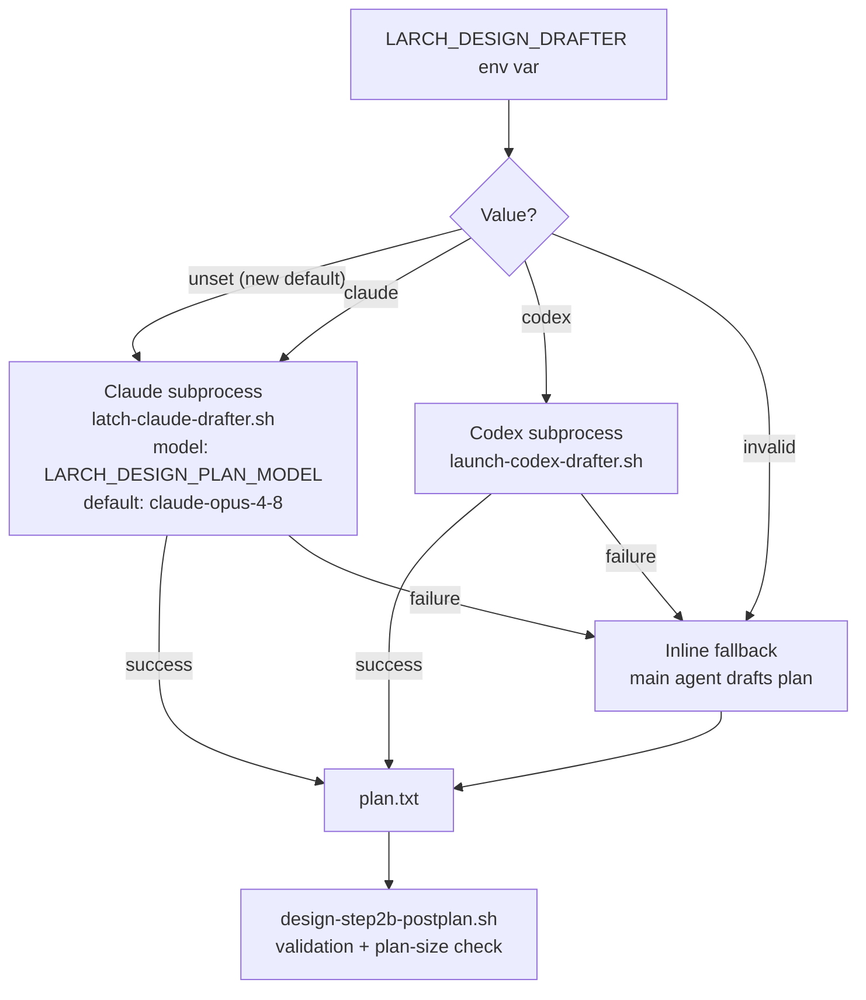

## Architecture Diagram

```mermaid
flowchart TD
    E["LARCH_DESIGN_DRAFTER env var"] --> D{Value?}
    D -->|"unset (new default)"| CL["Claude subprocess\nlatch-claude-drafter.sh\nmodel: LARCH_DESIGN_PLAN_MODEL\ndefault: claude-opus-4-8"]
    D -->|"claude"| CL
    D -->|"codex"| CO["Codex subprocess\nlaunch-codex-drafter.sh"]
    D -->|"invalid"| IL["Inline fallback\nmain agent drafts plan"]
    CL -->|success| PT["plan.txt"]
    CL -->|failure| IL
    CO -->|success| PT
    CO -->|failure| IL
    IL --> PT
    PT --> PP["design-step2b-postplan.sh\nvalidation + plan-size check"]
```
