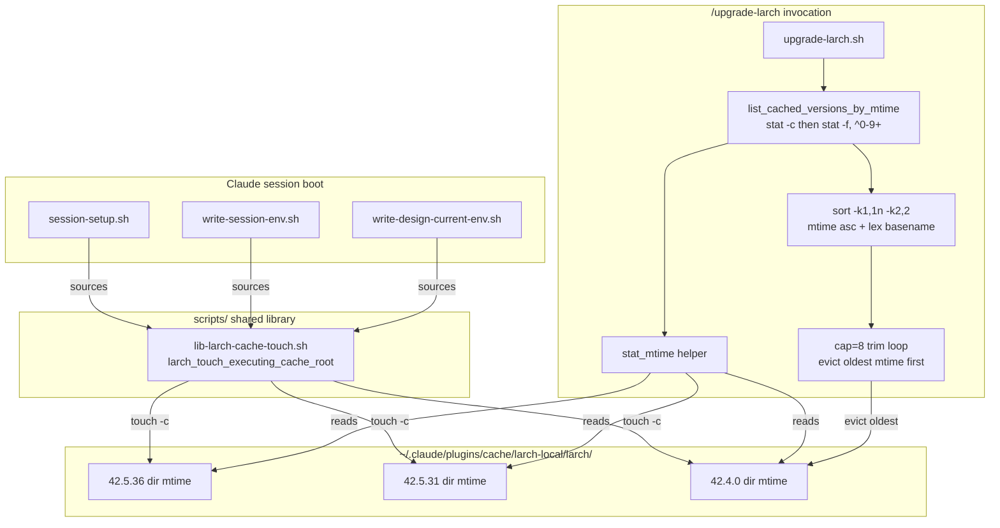

## Architecture Diagram

```mermaid
flowchart TD
    subgraph SessionBoot["Claude session boot"]
        SS[session-setup.sh]
        WSE[write-session-env.sh]
        WDCE[write-design-current-env.sh]
    end

    subgraph SharedLib["scripts/ shared library"]
        LIB[lib-larch-cache-touch.sh<br/>larch_touch_executing_cache_root]
    end

    subgraph CacheFS["~/.claude/plugins/cache/larch-local/larch/"]
        D1[42.5.36 dir mtime]
        D2[42.5.31 dir mtime]
        D3[42.4.0 dir mtime]
    end

    subgraph UpgradeFlow["/upgrade-larch invocation"]
        UL[upgrade-larch.sh]
        LV[list_cached_versions_by_mtime<br/>stat -c then stat -f, ^0-9+]
        SM[stat_mtime helper]
        SORT[sort -k1,1n -k2,2<br/>mtime asc + lex basename]
        PRUNE[cap=8 trim loop<br/>evict oldest mtime first]
    end

    SS -->|sources| LIB
    WSE -->|sources| LIB
    WDCE -->|sources| LIB

    LIB -->|touch -c| D1
    LIB -->|touch -c| D2
    LIB -->|touch -c| D3

    UL --> LV
    LV --> SM
    SM -->|reads| D1
    SM -->|reads| D2
    SM -->|reads| D3
    LV --> SORT
    SORT --> PRUNE
    PRUNE -->|evict oldest| D3
```
