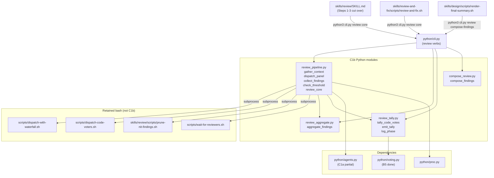

## Architecture Diagram

```mermaid
graph TD
    SKILL["skills/review/SKILL.md\n(Steps 1-3 cut over)"]

    CLI["python/cli.py\n(review verbs)"]

    subgraph C1b_modules ["C1b Python modules"]
        RP["review_pipeline.py\ngather_context\ndispatch_panel\ncollect_findings\ncheck_threshold\nreview_core"]
        RA["review_aggregate.py\naggregate_findings"]
        RT["review_tally.py\ntally_code_votes\nemit_tally\nlog_phase"]
        CR["compose_review.py\ncompose_findings"]
    end

    subgraph retained_bash ["Retained bash (not C1b)"]
        WF["scripts/dispatch-with-waterfall.sh"]
        DC["scripts/dispatch-code-voters.sh"]
        PNF["skills/review/scripts/prune-nit-findings.sh"]
        WFR["scripts/wait-for-reviewers.sh"]
    end

    subgraph deps ["Dependencies"]
        VOT["python/voting.py\n(B5 done)"]
        AGENTS["python/agents.py\n(C1a partial)"]
        PROC["python/proc.py"]
    end

    SKILL -->|"python3 cli.py review core"| CLI
    CLI --> RP
    CLI --> RA
    CLI --> RT
    CLI --> CR

    RP -->|"subprocess"| WF
    RP -->|"subprocess"| DC
    RP -->|"subprocess"| PNF
    RP -->|"subprocess"| WFR
    RP --> RA
    RP --> RT

    RT --> VOT
    RP --> AGENTS
    RP --> PROC

    RAF["skills/review-and-fix/scripts/review-and-fix.sh"] -->|"python3 cli.py review core"| CLI
    RFS["skills/design/scripts/render-final-summary.sh"] -->|"python3 cli.py review compose-findings"| CLI
```
