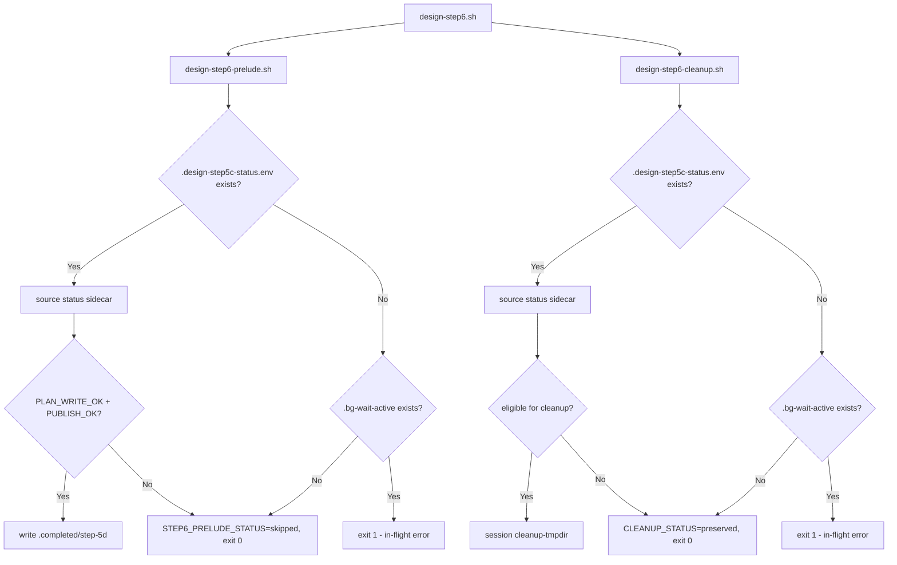

## Architecture Diagram

```mermaid
flowchart TD
    S6[design-step6.sh] --> PRE[design-step6-prelude.sh]
    PRE --> CHECK1{.design-step5c-status.env exists?}
    CHECK1 -- Yes --> SOURCE[source status sidecar]
    SOURCE --> GATE2{PLAN_WRITE_OK + PUBLISH_OK?}
    GATE2 -- Yes --> SENTINEL[write .completed/step-5d]
    GATE2 -- No --> SKIP[STEP6_PRELUDE_STATUS=skipped, exit 0]
    CHECK1 -- No --> CHECK2{.bg-wait-active exists?}
    CHECK2 -- Yes --> INFLIGHT[exit 1 - in-flight error]
    CHECK2 -- No --> SKIP

    S6 --> CLEAN[design-step6-cleanup.sh]
    CLEAN --> CHECK3{.design-step5c-status.env exists?}
    CHECK3 -- Yes --> SOURCE2[source status sidecar]
    SOURCE2 --> GATE3{eligible for cleanup?}
    GATE3 -- Yes --> RM[session cleanup-tmpdir]
    GATE3 -- No --> PRES[CLEANUP_STATUS=preserved, exit 0]
    CHECK3 -- No --> CHECK4{.bg-wait-active exists?}
    CHECK4 -- Yes --> INFLIGHT2[exit 1 - in-flight error]
    CHECK4 -- No --> PRES
```
