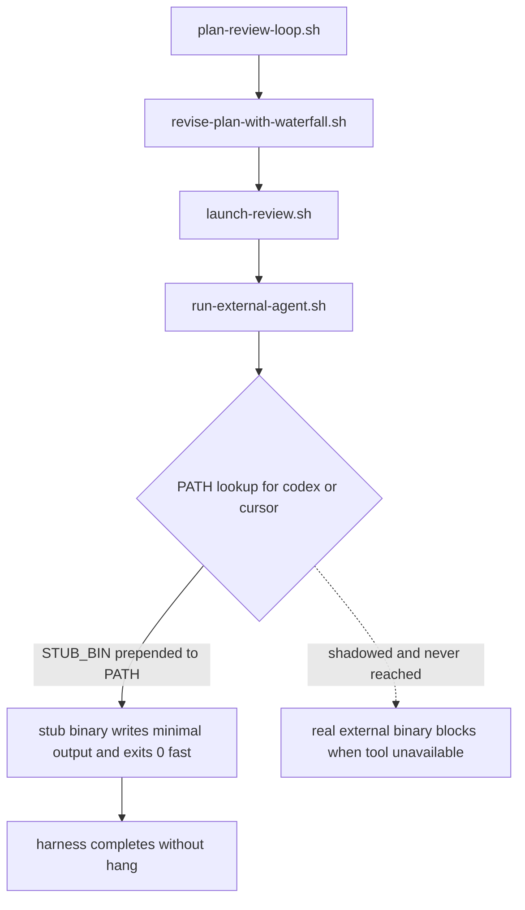

## Architecture Diagram

```mermaid
graph TD
    LOOP[plan-review-loop.sh] --> REVISE[revise-plan-with-waterfall.sh]
    REVISE --> LAUNCH[launch-review.sh]
    LAUNCH --> AGENT[run-external-agent.sh]
    AGENT --> RESOLVE{PATH lookup for codex or cursor}
    RESOLVE -->|STUB_BIN prepended to PATH| STUB[stub binary writes minimal output and exits 0 fast]
    RESOLVE -.->|shadowed and never reached| REAL[real external binary blocks when tool unavailable]
    STUB --> DONE[harness completes without hang]
```
