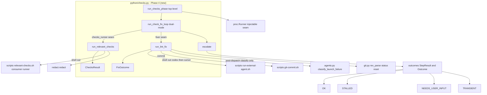

## Architecture Diagram

```mermaid
graph TD
    subgraph checks_py["python/checks.py - Phase 4 (new)"]
        RCP[run_checks_phase top-level]
        LOOP[run_check_fix_loop dual-mode]
        CR[run_relevant_checks]
        FX[run_lint_fix]
        ESC[escalate]
        CRES[ChecksResult]
        FRES[FixOutcome]
    end

    RCP --> LOOP
    LOOP -->|checks_runner seam| CR
    LOOP -->|fixer seam| FX
    LOOP --> ESC
    CR --> CRES
    FX --> FRES

    CR -->|shell out| RC[scripts relevant-checks.sh consumer runner]
    FX -->|shell out codex then cursor| REA[scripts run-external-agent.sh]
    FX -->|commit| GC[scripts git-commit.sh]
    FX -->|post-dispatch classify only| AG[agents.py classify_launch_failure]

    CR --> RED[redact.redact]
    RCP --> PROC[proc.Runner injectable seam]
    FX --> GIT[git.py rev_parse status reset]
    ESC --> OUT[outcomes StepResult and Outcome]

    OUT --> OK[OK]
    OUT --> STALL[STALLED]
    OUT --> NUI[NEEDS_USER_INPUT]
    OUT --> TRANS[TRANSIENT]
```
