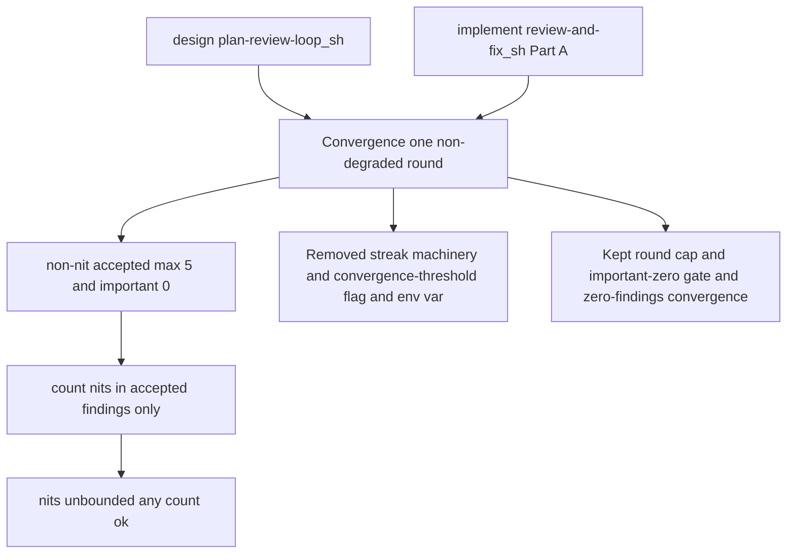

## Architecture Diagram

```mermaid
graph TD
    PRL[design plan-review-loop_sh]
    RAF[implement review-and-fix_sh Part A]
    RULE[Convergence one non-degraded round]
    BOUND[non-nit accepted max 5 and important 0]
    NITS[nits unbounded any count ok]
    NITCOUNT[count nits in accepted findings only]
    REMOVED[Removed streak machinery and convergence-threshold flag and env var]
    KEPT[Kept round cap and important-zero gate and zero-findings convergence]

    PRL --> RULE
    RAF --> RULE
    RULE --> BOUND
    BOUND --> NITCOUNT
    NITCOUNT --> NITS
    RULE --> REMOVED
    RULE --> KEPT
```
