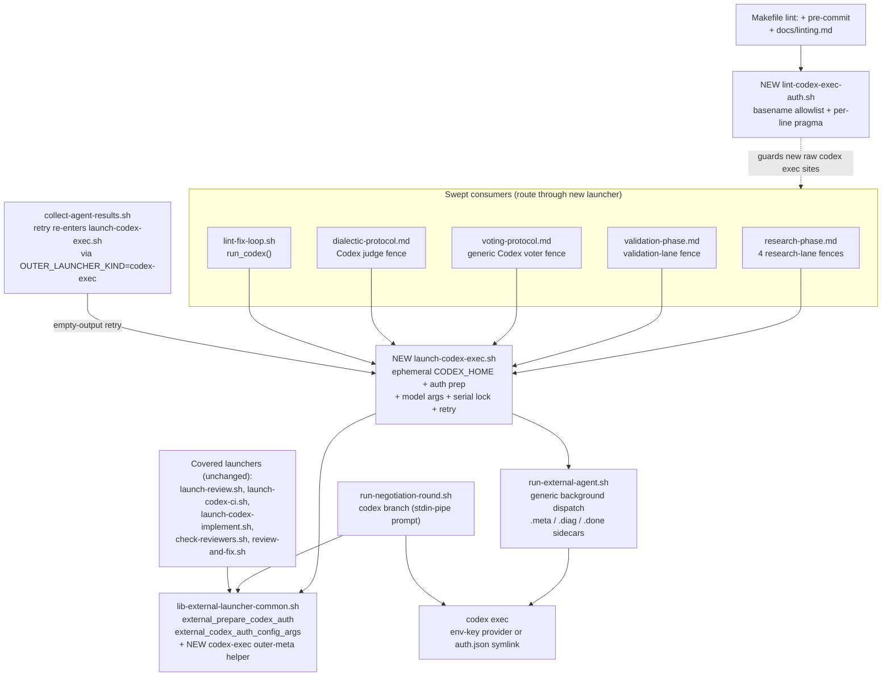

## Architecture Diagram

```mermaid
graph TD
    subgraph Consumers["Swept consumers (route through new launcher)"]
        RP["research-phase.md<br/>4 research-lane fences"]
        VP["validation-phase.md<br/>validation-lane fence"]
        VT["voting-protocol.md<br/>generic Codex voter fence"]
        DJ["dialectic-protocol.md<br/>Codex judge fence"]
        LF["lint-fix-loop.sh<br/>run_codex()"]
    end

    NEG["run-negotiation-round.sh<br/>codex branch (stdin-pipe prompt)"]

    LCE["NEW launch-codex-exec.sh<br/>ephemeral CODEX_HOME + auth prep<br/>+ model args + serial lock + retry"]

    LIB["lib-external-launcher-common.sh<br/>external_prepare_codex_auth<br/>external_codex_auth_config_args<br/>+ NEW codex-exec outer-meta helper"]

    REA["run-external-agent.sh<br/>generic background dispatch<br/>.meta / .diag / .done sidecars"]

    CODEX["codex exec<br/>env-key provider or auth.json symlink"]

    CAR["collect-agent-results.sh<br/>retry re-enters launch-codex-exec.sh<br/>via OUTER_LAUNCHER_KIND=codex-exec"]

    LINT["NEW lint-codex-exec-auth.sh<br/>basename allowlist + per-line pragma"]

    MK["Makefile lint: + pre-commit<br/>+ docs/linting.md"]

    LEGACY["Covered launchers (unchanged):<br/>launch-review.sh, launch-codex-ci.sh,<br/>launch-codex-implement.sh,<br/>check-reviewers.sh, review-and-fix.sh"]

    RP --> LCE
    VP --> LCE
    VT --> LCE
    DJ --> LCE
    LF --> LCE
    LCE --> LIB
    LCE --> REA
    REA --> CODEX
    NEG --> LIB
    NEG --> CODEX
    CAR -->|"empty-output retry"| LCE
    LEGACY --> LIB
    MK --> LINT
    LINT -.->|"guards new raw codex exec sites"| Consumers
```
