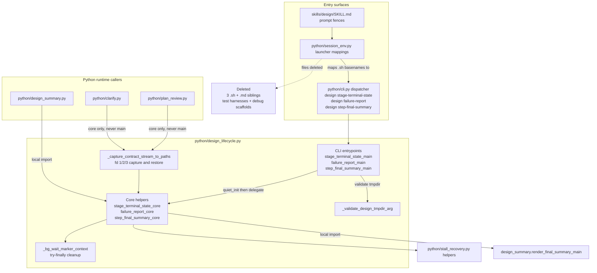

## Architecture Diagram

```mermaid
graph TD
    subgraph Entry["Entry surfaces"]
        PROMPT["skills/design/SKILL.md prompt fences"]
        SENV["python/session_env.py launcher mappings"]
        CLI["python/cli.py dispatcher<br/>design stage-terminal-state<br/>design failure-report<br/>design step-final-summary"]
    end

    subgraph Callers["Python runtime callers"]
        PR["python/plan_review.py"]
        CLAR["python/clarify.py"]
        SUMM["python/design_summary.py"]
    end

    subgraph Lifecycle["python/design_lifecycle.py"]
        MAIN["CLI entrypoints<br/>stage_terminal_state_main<br/>failure_report_main<br/>step_final_summary_main"]
        CORE["Core helpers<br/>stage_terminal_state_core<br/>failure_report_core<br/>step_final_summary_core"]
        CAP["_capture_contract_stream_to_paths<br/>fd 1/2/3 capture and restore"]
        BG["_bg_wait_marker_context<br/>try-finally cleanup"]
        VAL["_validate_design_tmpdir_arg"]
    end

    STALL["python/stall_recovery.py helpers"]
    RENDER["design_summary.render_final_summary_main"]
    DELETED["Deleted<br/>3 .sh + .md siblings<br/>test harnesses + debug scaffolds"]

    PROMPT --> SENV
    SENV -->|maps .sh basenames to| CLI
    CLI --> MAIN
    MAIN -->|validate tmpdir| VAL
    MAIN -->|quiet_init then delegate| CORE
    PR -->|core only, never main| CAP
    CLAR -->|core only, never main| CAP
    CAP --> CORE
    SUMM -->|local import| CORE
    CORE -->|local import| RENDER
    CORE --> STALL
    CORE --> BG
    SENV -.->|files deleted| DELETED
```
