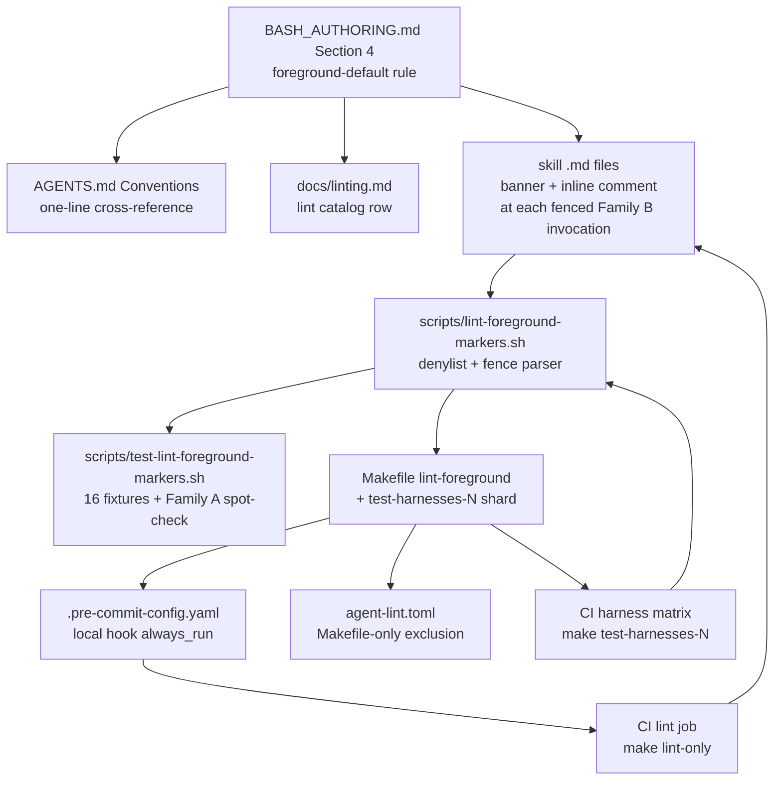

## Architecture Diagram

```mermaid
flowchart TD
    Rule[BASH_AUTHORING.md Section 4<br/>foreground-default rule]
    Cross[AGENTS.md Conventions<br/>one-line cross-reference]
    Catalog[docs/linting.md<br/>lint catalog row]

    Markers[skill .md files<br/>banner + inline comment<br/>at each fenced Family B invocation]
    Linter[scripts/lint-foreground-markers.sh<br/>denylist + fence parser]
    Harness[scripts/test-lint-foreground-markers.sh<br/>16 fixtures + Family A spot-check]

    MakeTarget[Makefile lint-foreground<br/>+ test-harnesses-N shard]
    PreCommit[.pre-commit-config.yaml<br/>local hook always_run]
    AgentLint[agent-lint.toml<br/>Makefile-only exclusion]

    CILint[CI lint job<br/>make lint-only]
    CIHarness[CI harness matrix<br/>make test-harnesses-N]

    Rule --> Cross
    Rule --> Catalog
    Rule --> Markers

    Markers --> Linter
    Linter --> Harness
    Linter --> MakeTarget

    MakeTarget --> PreCommit
    MakeTarget --> AgentLint

    PreCommit --> CILint
    MakeTarget --> CIHarness

    CILint --> Markers
    CIHarness --> Linter
```
