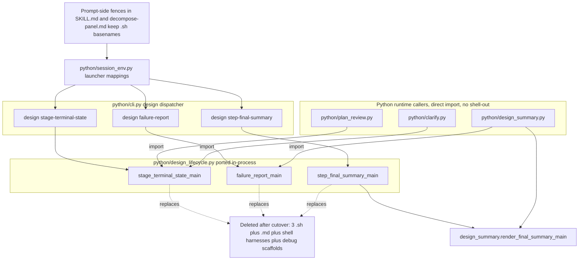

## Architecture Diagram

```mermaid
graph TD
    Fence["Prompt-side fences in SKILL.md and decompose-panel.md keep .sh basenames"]
    Map["python/session_env.py launcher mappings"]

    subgraph CLI["python/cli.py design dispatcher"]
        V1["design stage-terminal-state"]
        V2["design failure-report"]
        V3["design step-final-summary"]
    end

    subgraph Lifecycle["python/design_lifecycle.py ported in-process"]
        F1["stage_terminal_state_main"]
        F2["failure_report_main"]
        F3["step_final_summary_main"]
    end

    subgraph Callers["Python runtime callers, direct import, no shell-out"]
        PR["python/plan_review.py"]
        CL["python/clarify.py"]
        DS["python/design_summary.py"]
    end

    Summary["design_summary.render_final_summary_main"]
    Deleted["Deleted after cutover: 3 .sh plus .md plus shell harnesses plus debug scaffolds"]

    Fence --> Map
    Map --> V1
    Map --> V2
    Map --> V3
    V1 --> F1
    V2 --> F2
    V3 --> F3
    PR -->|import| F1
    CL -->|import| F1
    DS -->|import| F2
    F3 --> Summary
    DS --> Summary
    F1 -. replaces .-> Deleted
    F2 -. replaces .-> Deleted
    F3 -. replaces .-> Deleted
```
