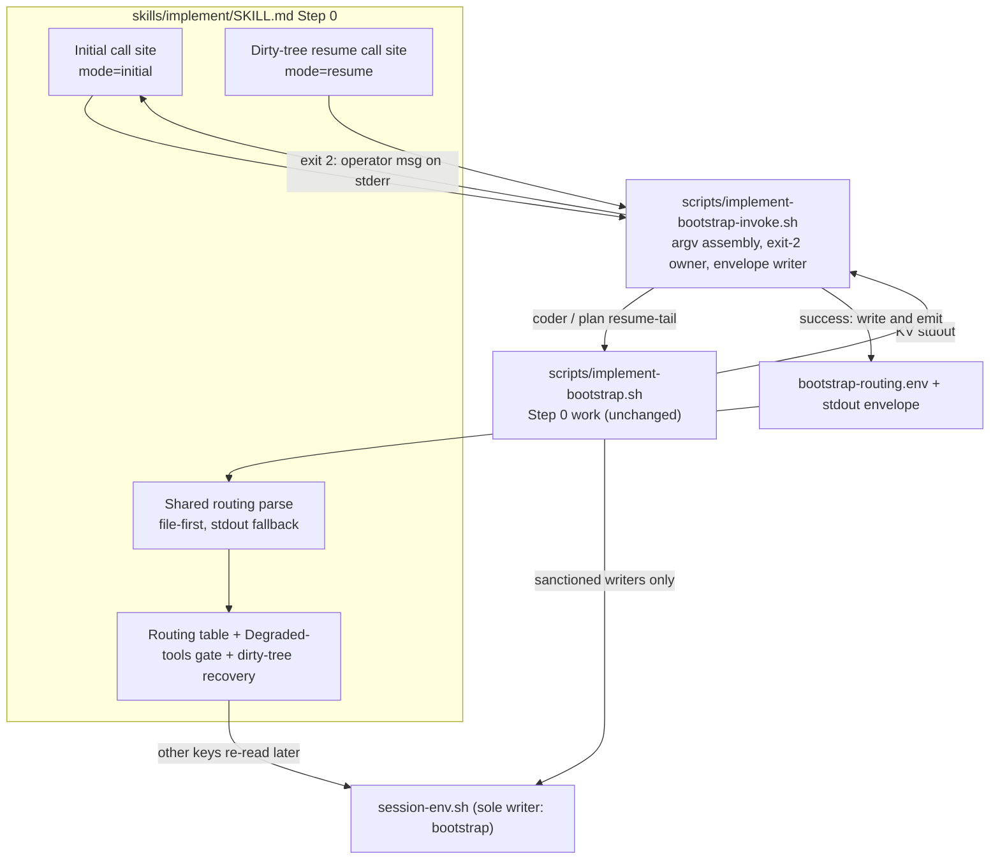

## Architecture Diagram

```mermaid
graph TD
  subgraph Orchestrator["skills/implement/SKILL.md Step 0"]
    INIT["Initial call site<br/>mode=initial"]
    RESUME["Dirty-tree resume call site<br/>mode=resume"]
    PARSE["Shared routing parse<br/>file-first, stdout fallback"]
    CONSUMERS["Routing table + Degraded-tools gate + dirty-tree recovery"]
  end

  WRAP["scripts/implement-bootstrap-invoke.sh<br/>argv assembly, exit-2 owner, envelope writer"]
  BOOT["scripts/implement-bootstrap.sh<br/>Step 0 work (unchanged)"]
  ENV["bootstrap-routing.env + stdout envelope"]
  SESS["session-env.sh (sole writer: bootstrap)"]

  INIT --> WRAP
  RESUME --> WRAP
  WRAP -->|"coder / plan resume-tail"| BOOT
  BOOT -->|"KV stdout"| WRAP
  BOOT -->|"sanctioned writers only"| SESS
  WRAP -->|"success: write and emit"| ENV
  WRAP -->|"exit 2: operator msg on stderr"| INIT
  ENV --> PARSE
  PARSE --> CONSUMERS
  CONSUMERS -->|"other keys re-read later"| SESS
```
