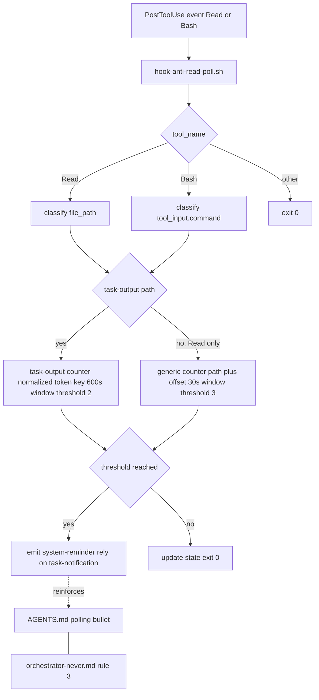

## Architecture Diagram

```mermaid
graph TD
    EV[PostToolUse event Read or Bash] --> HOOK[hook-anti-read-poll.sh]
    HOOK --> BR{tool_name}
    BR -->|Read| RP[classify file_path]
    BR -->|Bash| BP[classify tool_input.command]
    BR -->|other| EX[exit 0]
    RP --> TQ{task-output path}
    BP --> TQ
    TQ -->|yes| TC[task-output counter normalized token key 600s window threshold 2]
    TQ -->|no, Read only| GC[generic counter path plus offset 30s window threshold 3]
    TC --> TH{threshold reached}
    GC --> TH
    TH -->|yes| WARN[emit system-reminder rely on task-notification]
    TH -->|no| ST[update state exit 0]
    DOC1[AGENTS.md polling bullet] --- DOC2[orchestrator-never.md rule 3]
    WARN -.reinforces.-> DOC1
```
