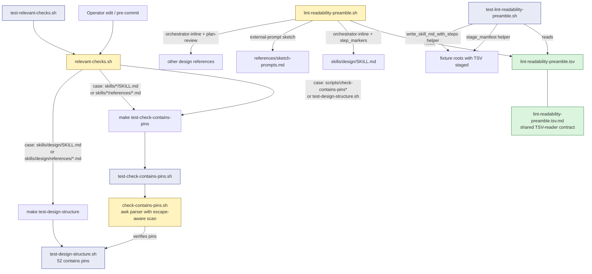

## Architecture Diagram

```mermaid
graph TD
    classDef new fill:#dbf4dd,stroke:#1f7a36
    classDef updated fill:#fff3bf,stroke:#856404
    classDef harness fill:#e8eaf6,stroke:#283593

    User[Operator edit / pre-commit] --> RC[relevant-checks.sh]
    RC -->|case: scripts/check-contains-pins*\nor test-design-structure.sh| MT1[make test-check-contains-pins]
    RC -->|case: skills/&ast;/SKILL.md\nor skills/&ast;/references/&ast;.md| MT1
    RC -->|case: skills/design/SKILL.md\nor skills/design/references/&ast;.md| MT2[make test-design-structure]

    MT1 --> TCCP[test-check-contains-pins.sh]
    TCCP --> CCP[check-contains-pins.sh\nawk parser with escape-aware scan]
    CCP -->|verifies pins| TDS[test-design-structure.sh\n52 contains pins]
    MT2 --> TDS

    LRP[lint-readability-preamble.sh] -->|reads| LTSV[lint-readability-preamble.tsv]
    TLRP[test-lint-readability-preamble.sh] -->|reads| LTSV
    LTSV --- LTSVMD[lint-readability-preamble.tsv.md\nshared TSV-reader contract]

    LRP -->|orchestrator-inline + step_markers| SKILL[skills/design/SKILL.md]
    LRP -->|external-prompt sketch| SKETCH[references/sketch-prompts.md]
    LRP -->|orchestrator-inline + plan-review| OTHER[other design references]

    TLRP -->|stage_manifest helper| FIXROOT[fixture roots with TSV staged]
    TLRP -->|write_skill_md_with_steps helper| FIXROOT

    TRC[test-relevant-checks.sh] --> RC

    class LTSV,LTSVMD new
    class CCP,LRP,RC updated
    class TCCP,TLRP,TRC,TDS harness
```
