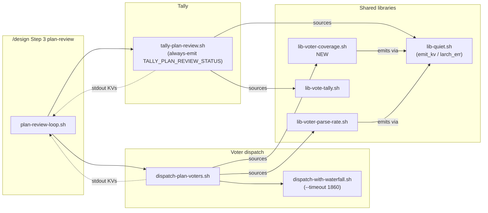

## Architecture Diagram

```mermaid
graph LR
    subgraph design_step3["/design Step 3 plan-review"]
        LOOP["plan-review-loop.sh"]
    end

    subgraph dispatch_layer["Voter dispatch"]
        DPV["dispatch-plan-voters.sh"]
        WATER["dispatch-with-waterfall.sh<br/>(--timeout 1860)"]
    end

    subgraph tally_layer["Tally"]
        TALLY["tally-plan-review.sh<br/>(always-emit TALLY_PLAN_REVIEW_STATUS)"]
    end

    subgraph libs["Shared libraries"]
        COV["lib-voter-coverage.sh<br/>NEW"]
        PARSE["lib-voter-parse-rate.sh"]
        QUIET["lib-quiet.sh<br/>(emit_kv / larch_err)"]
        VOTE["lib-vote-tally.sh"]
    end

    LOOP --> DPV
    LOOP --> TALLY

    DPV -- sources --> COV
    DPV -- sources --> PARSE
    DPV --> WATER

    TALLY -- sources --> VOTE
    TALLY -- sources --> QUIET

    COV -- emits via --> QUIET
    PARSE -- emits via --> QUIET

    DPV -. stdout KVs .-> LOOP
    TALLY -. stdout KVs .-> LOOP
```
