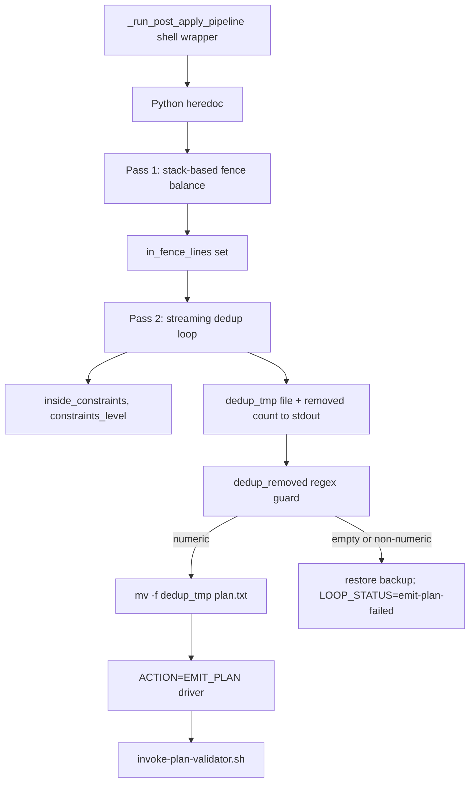

## Architecture Diagram

```mermaid
flowchart TD
  caller["_run_post_apply_pipeline shell wrapper"]
  py["Python heredoc"]
  pass1["Pass 1: stack-based fence balance"]
  set["in_fence_lines set"]
  pass2["Pass 2: streaming dedup loop"]
  state["inside_constraints, constraints_level"]
  out["dedup_tmp file + removed count to stdout"]
  guard["dedup_removed regex guard"]
  mv["mv -f dedup_tmp plan.txt"]
  rollback["restore backup; LOOP_STATUS=emit-plan-failed"]
  emit["ACTION=EMIT_PLAN driver"]
  validator["invoke-plan-validator.sh"]

  caller --> py
  py --> pass1
  pass1 --> set
  set --> pass2
  pass2 --> state
  pass2 --> out
  out --> guard
  guard -- numeric --> mv
  guard -- empty or non-numeric --> rollback
  mv --> emit
  emit --> validator
```
