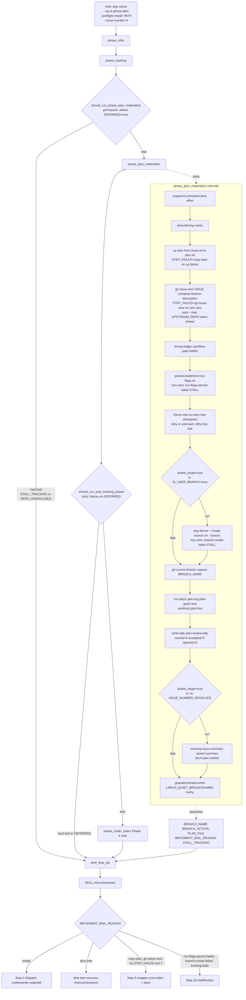

## Architecture Diagram

```mermaid
graph TD
    MAIN["main argv parse<br/>--up-to-phase plan<br/>--preflight-tmpdir PATH<br/>--issue-number N"] --> PINFRA[phase_infra]
    PINFRA --> PTRACK[phase_tracking]
    PTRACK --> GUARDPLAN{should_run_phase_plan_materialize<br/>permissive: allows DEFERRED=true}
    GUARDPLAN -->|hard bail<br/>STALL_TRACKING or REPO_UNAVAILABLE| EMITFINAL[emit_final_tail]
    GUARDPLAN -->|else| PPLAN[phase_plan_materialize]
    PPLAN --> GUARDCODER{should_run_post_tracking_phase<br/>strict: blocks on DEFERRED}
    GUARDCODER -->|hard bail or DEFERRED| EMITFINAL
    GUARDCODER -->|else| PCODER[phase_coder_select Phase 4 stub]
    PCODER --> EMITFINAL

    subgraph PHASE3[phase_plan_materialize internals]
        direction TB
        S1[snapshot-untracked best-effort] --> S2[token/timing marks]
        S2 --> S3[cp plan-from-issue.txt to plan.txt<br/>STEP_FAILED=copy-plan on cp failure]
        S3 --> S4[gh issue view ISSUE compose feature-description<br/>STEP_FAILED=gh-issue-view on non-zero<br/>uses --repo UPSTREAM_REPO when forked]
        S4 --> S5[timing-ledger workflow-path HARD]
        S5 --> S6[persist-implement-run-flags.sh<br/>non-zero: run-flags-persist-failed STALL]
        S6 --> S7[check-mid-run-dirty-tree checkpoint<br/>dirty or unknown: dirty-tree bail]
        S7 --> S8{forked_target=true<br/>or IS_USER_BRANCH=true}
        S8 -->|skip| S9
        S8 -->|run| S8A[slug derive + create-branch.sh --branch<br/>non-zero: branch-create-failed STALL]
        S8A --> S9[git-current-branch capture BRANCH_NAME]
        S9 --> S10[run-step1-plan-log plan-goals-test<br/>sanitized goal text]
        S10 --> S11[write-tally plan-review-tally<br/>rounds=0 accepted=0 rejected=0]
        S11 --> S12{forked_target=true<br/>or no ISSUE_NUMBER_RESOLVED}
        S12 -->|skip| S13
        S12 -->|run| S12A[tracking-issue-summary upsert-summary<br/>larch:plan marker]
        S12A --> S13[guarded breadcrumbs<br/>LARCH_QUIET_BREADCRUMBS truthy]
    end

    PPLAN -.body.-> PHASE3
    PHASE3 -.populates.-> KVTAIL["BRANCH_NAME, BRANCH_ACTION, PLAN_FILE,<br/>IMPLEMENT_BAIL_REASON, STALL_TRACKING"]
    KVTAIL --> EMITFINAL
    EMITFINAL --> ORCH[SKILL.md orchestrator]
    ORCH --> ROUTE{IMPLEMENT_BAIL_REASON}
    ROUTE -->|empty| STEP2[Step 2 dispatch implementer waterfall]
    ROUTE -->|dirty-tree| RECOVER[dirty-tree recovery AskUserQuestion]
    ROUTE -->|copy-plan, gh-issue-view via STEP_FAILED exit 2| ABORT[Step 0 wrapper print stderr + abort]
    ROUTE -->|run-flags-persist-failed, branch-create-failed, tracking bails| STEP18[Step 18 stall/finalize]
```
