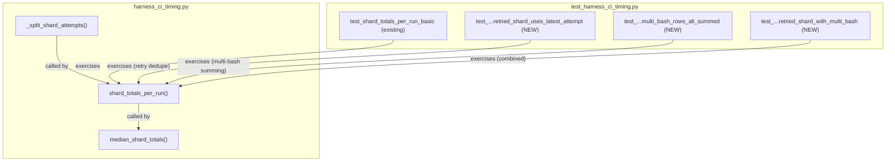

## Architecture Diagram

```mermaid
graph TD
    subgraph prod["harness_ci_timing.py"]
        SSA["_split_shard_attempts()"]
        STP["shard_totals_per_run()"]
        MST["median_shard_totals()"]
    end

    subgraph tests["test_harness_ci_timing.py"]
        TB["test_shard_totals_per_run_basic (existing)"]
        TR["test_...retried_shard_uses_latest_attempt (NEW)"]
        TM["test_...multi_bash_rows_all_summed (NEW)"]
        TC["test_...retried_shard_with_multi_bash (NEW)"]
    end

    SSA -->|"called by"| STP
    STP -->|"called by"| MST
    TB -->|"exercises"| STP
    TR -->|"exercises (retry dedupe)"| STP
    TM -->|"exercises (multi-bash summing)"| STP
    TC -->|"exercises (combined)"| STP
```
