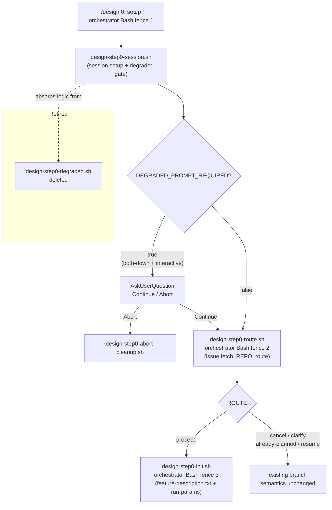

## Architecture Diagram

```mermaid
flowchart TD
    A["/design 0: setup\norchestrator Bash fence 1"] --> B["design-step0-session.sh\n(session setup + degraded gate)"]
    B --> C{DEGRADED_PROMPT_REQUIRED?}
    C -- "true\n(both-down + interactive)" --> D["AskUserQuestion\nContinue / Abort"]
    D -- Abort --> E["design-step0-abort-cleanup.sh"]
    D -- Continue --> F
    C -- false --> F["design-step0-route.sh\norchestrator Bash fence 2\n(issue fetch, REPO, route)"]
    F --> G{ROUTE}
    G -- proceed --> H["design-step0-init.sh\norchestrator Bash fence 3\n(feature-description.txt + run-params)"]
    G -- "cancel / clarify\nalready-planned / resume" --> I["existing branch\nsemantics unchanged"]

    subgraph "Retired"
        R["design-step0-degraded.sh\ndeleted"]
    end

    B -. "absorbs logic from" .-> R
```
