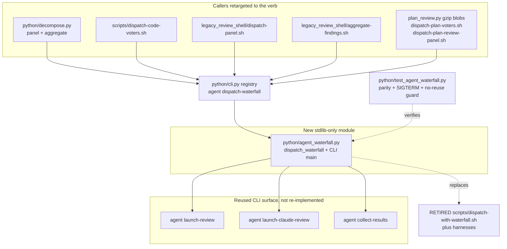

## Architecture Diagram

```mermaid
flowchart TD
    subgraph callers["Callers retargeted to the verb"]
        DEC["python/decompose.py<br/>panel + aggregate"]
        DCV["scripts/dispatch-code-voters.sh"]
        DPS["legacy_review_shell/dispatch-panel.sh"]
        AGG["legacy_review_shell/aggregate-findings.sh"]
        EMB["plan_review.py gzip blobs<br/>dispatch-plan-voters.sh<br/>dispatch-plan-review-panel.sh"]
    end

    CLI["python/cli.py registry<br/>agent dispatch-waterfall"]

    subgraph core["New stdlib-only module"]
        AW["python/agent_waterfall.py<br/>dispatch_waterfall + CLI main"]
    end

    subgraph reused["Reused CLI surface, not re-implemented"]
        LR["agent launch-review"]
        LCR["agent launch-claude-review"]
        CR["agent collect-results"]
    end

    TEST["python/test_agent_waterfall.py<br/>parity + SIGTERM + no-reuse guard"]
    DEL["RETIRED scripts/dispatch-with-waterfall.sh<br/>plus harnesses"]

    DEC --> CLI
    DCV --> CLI
    DPS --> CLI
    AGG --> CLI
    EMB --> CLI
    CLI --> AW
    AW --> LR
    AW --> LCR
    AW --> CR
    TEST -.->|verifies| AW
    AW -.->|replaces| DEL
```
