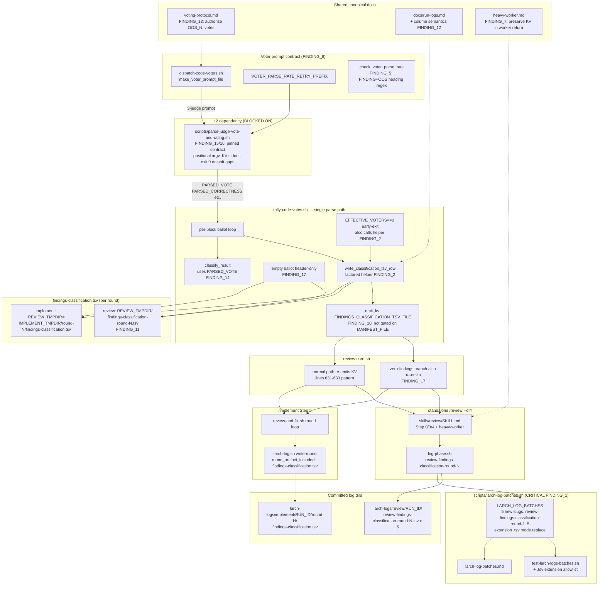

## Architecture Diagram

```mermaid
flowchart TB
    subgraph PromptSide["Voter prompt contract (FINDING_6)"]
        DCV[dispatch-code-voters.sh<br/>make_voter_prompt_file]
        DCV_RETRY[VOTER_PARSE_RATE_RETRY_PREFIX]
        DCV_PR[check_voter_parse_rate<br/>FINDING_5: FINDING+OOS heading regex]
    end

    subgraph L2["L2 dependency (BLOCKED ON)"]
        L2_PARSER[scripts/parse-judge-vote-and-rating.sh<br/>FINDING_15/16: pinned contract<br/>positional argv, KV stdout, exit 0 on soft gaps]
    end

    subgraph TallyCore["tally-code-votes.sh — single parse path"]
        TALLY_LOOP[per-block ballot loop]
        TALLY_HELPER[write_classification_tsv_row<br/>factored helper FINDING_2]
        TALLY_ZERO[EFFECTIVE_VOTERS==0 early-exit<br/>also calls helper FINDING_2]
        TALLY_EMPTY[empty ballot header-only<br/>FINDING_17]
        TALLY_CLASSIFY[classify_result<br/>uses PARSED_VOTE FINDING_14]
        TALLY_KV[emit_kv FINDINGS_CLASSIFICATION_TSV_FILE<br/>FINDING_10: not gated on MANIFEST_FILE]
    end

    subgraph TSV_Output["findings-classification.tsv (per round)"]
        TSV_IMPL[implement: REVIEW_TMPDIR=<br/>IMPLEMENT_TMPDIR/round-N/findings-classification.tsv]
        TSV_REVIEW[review: REVIEW_TMPDIR/<br/>findings-classification-round-N.tsv<br/>FINDING_11]
    end

    subgraph ReviewCore["review-core.sh"]
        RC_NORMAL[normal path re-emits KV<br/>lines 631-633 pattern]
        RC_ZERO[zero-findings branch also re-emits<br/>FINDING_17]
    end

    subgraph Implement["/implement Step 5"]
        IMPL_LOOP[review-and-fix.sh round loop]
        IMPL_WRITE[larch-log.sh write-round<br/>round_artifact_included +<br/>findings-classification.tsv]
    end

    subgraph Review["standalone /review --diff"]
        REV_WRAP[skills/review/SKILL.md<br/>Step 0/3/4 + heavy-worker]
        REV_LOGP[log-phase.sh<br/>review-findings-classification-round-N]
    end

    subgraph BatchTable["scripts/larch-log-batches.sh (CRITICAL FINDING_1)"]
        LB_TABLE[LARCH_LOG_BATCHES<br/>5 new slugs: review-findings-classification-round-1..5<br/>extension .tsv mode replace]
        LB_DOC[larch-log-batches.md]
        LB_TEST[test-larch-logs-batches.sh<br/>+ .tsv extension allowlist]
    end

    subgraph SharedDocs["Shared canonical docs"]
        VP[voting-protocol.md<br/>FINDING_13: authorize OOS_N: votes]
        DOC_RL[docs/run-logs.md<br/>+ column semantics FINDING_12]
        HW[heavy-worker.md<br/>FINDING_7: preserve KV in worker return]
    end

    subgraph CommittedLogs["Committed log dirs"]
        IMPL_DIR[larch-logs/implement/RUN_ID/round-N/<br/>findings-classification.tsv]
        REV_DIR[larch-logs/review/RUN_ID/<br/>review-findings-classification-round-N.tsv x 5]
    end

    DCV -->|3-judge prompt| L2_PARSER
    DCV_RETRY --> L2_PARSER
    L2_PARSER -->|PARSED_VOTE PARSED_CORRECTNESS etc.| TALLY_LOOP
    TALLY_LOOP --> TALLY_CLASSIFY
    TALLY_LOOP --> TALLY_HELPER
    TALLY_ZERO --> TALLY_HELPER
    TALLY_HELPER --> TSV_IMPL
    TALLY_HELPER --> TSV_REVIEW
    TALLY_EMPTY --> TSV_IMPL
    TALLY_EMPTY --> TSV_REVIEW
    TALLY_HELPER --> TALLY_KV
    TALLY_KV --> RC_NORMAL
    TALLY_KV --> RC_ZERO

    RC_NORMAL --> IMPL_LOOP
    RC_NORMAL --> REV_WRAP
    RC_ZERO --> IMPL_LOOP
    RC_ZERO --> REV_WRAP

    IMPL_LOOP --> IMPL_WRITE
    IMPL_WRITE --> IMPL_DIR

    REV_WRAP --> REV_LOGP
    REV_LOGP --> LB_TABLE
    REV_LOGP --> REV_DIR

    LB_TABLE -.-> LB_DOC
    LB_TABLE -.-> LB_TEST
    VP -.-> DCV
    DOC_RL -.-> TALLY_HELPER
    HW -.-> REV_WRAP
```
