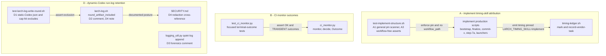

## Architecture Diagram

```mermaid
graph TD
    subgraph A["A - implement timing-skill attribution"]
        prod["implement production scripts<br/>bootstrap, finalize, commit-x, step-7a, launchers"]
        ledger["timing-ledger.sh<br/>mark and record-vendor-task"]
        struct["test-implement-structure.sh<br/>A1 general pin scanner, A3 workflow-free asserts"]
        prod -->|emit timing pinned LARCH_TIMING_SKILL=implement| ledger
        struct -->|enforce pin and no workflow_path| prod
    end
    subgraph B["B - CI monitor outcomes"]
        monitor["ci_monitor.py<br/>monitor, decide, Outcome"]
        citest["test_ci_monitor.py<br/>focused terminal-outcome tests"]
        citest -->|assert OK and TRANSIENT outcomes| monitor
    end
    subgraph D["D - dynamic-Codex run-log retention"]
        larchlog["larch-log.sh round_artifact_included<br/>D2 comment, D4 note"]
        logtest["test-larch-log-write-round.sh<br/>D1 static-Codex json and cap-hit excludes"]
        quiet["logging_util.py quiet-log append<br/>D3 forensics comment"]
        security["SECURITY.md<br/>D4 redaction cross-reference"]
        logtest -->|assert exclusion| larchlog
        larchlog -->|documented posture| security
    end
```
