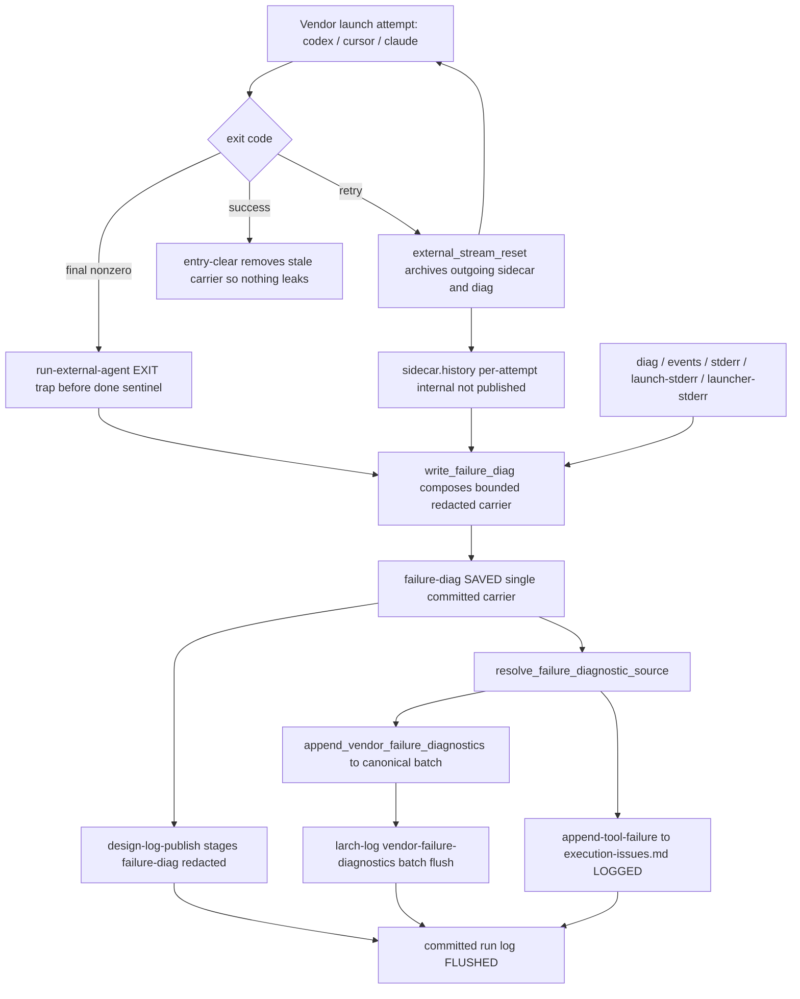

## Architecture Diagram

```mermaid
flowchart TD
    A[Vendor launch attempt: codex / cursor / claude] --> B{exit code}
    B -->|retry| C[external_stream_reset archives outgoing sidecar and diag]
    C --> H[sidecar.history per-attempt internal not published]
    C --> A
    B -->|success| S[entry-clear removes stale carrier so nothing leaks]
    B -->|final nonzero| D[run-external-agent EXIT trap before done sentinel]
    D --> E[write_failure_diag composes bounded redacted carrier]
    H --> E
    G[diag / events / stderr / launch-stderr / launcher-stderr] --> E
    E --> F[failure-diag SAVED single committed carrier]
    F --> R[resolve_failure_diagnostic_source]
    R --> L[append-tool-failure to execution-issues.md LOGGED]
    R --> V[append_vendor_failure_diagnostics to canonical batch]
    F --> P1[design-log-publish stages failure-diag redacted]
    V --> P2[larch-log vendor-failure-diagnostics batch flush]
    P1 --> CR[committed run log FLUSHED]
    P2 --> CR
    L --> CR
```
