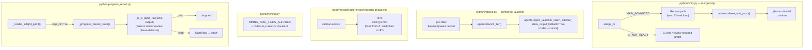

## Architecture Diagram

```mermaid
graph TD
    subgraph ship.py["python/ship.py — merge loop"]
        MERGE[merge_pr] -->|MAIN_ADVANCED| REBASE_PATH["Rebase path\n(was: CI wait loop)"]
        MERGE -->|CI_NOT_READY| CI_WAIT["CI wait / review-required probe"]
        REBASE_PATH --> REBASE_AND_PUSH["rebase.rebase_and_push()"]
        REBASE_AND_PUSH --> CI_INITIAL["phase=ci-initial\ncontinue"]
    end

    subgraph rebase.py["python/rebase.py — conflict-fix launcher"]
        PRECLEAR["pre-clear\n${output}.token-record"] --> LAUNCH_TIER["agents.launch_tier()"]
        LAUNCH_TIER --> INGEST["agents.ingest_launcher_token_sidecar()\nallow_output_fallback=True\n(codex + cursor)"]
    end

    subgraph research_phase["skills/research/references/research-phase.md"]
        SIDECAR_CHECK["sidecar exists?"] --> APPEND_RC["rc=0\ncmd || rc=$?\n(fixed from if ! cmd; then rc=$?)"]
    end

    subgraph timing.py["python/timing.py"]
        ALLOWED["TIMING_TASK_KINDS_ALLOWED\n+ codex-ci, cursor-ci, claude-ci"]
    end

    subgraph progress_report.py["python/progress_report.py"]
        INFLIGHT["_render_inflight_gantt()"] -->|skip_ci=True| VENDOR_ROWS["_progress_vendor_rows()"]
        VENDOR_ROWS --> CI_FILTER["_is_ci_gantt_row(kind, output)\n(mirrors render-review-phase-detail.sh)"]
        CI_FILTER -->|skip| DROP[dropped]
        CI_FILTER -->|keep| GANTT["GanttRow → chart"]
    end
```
