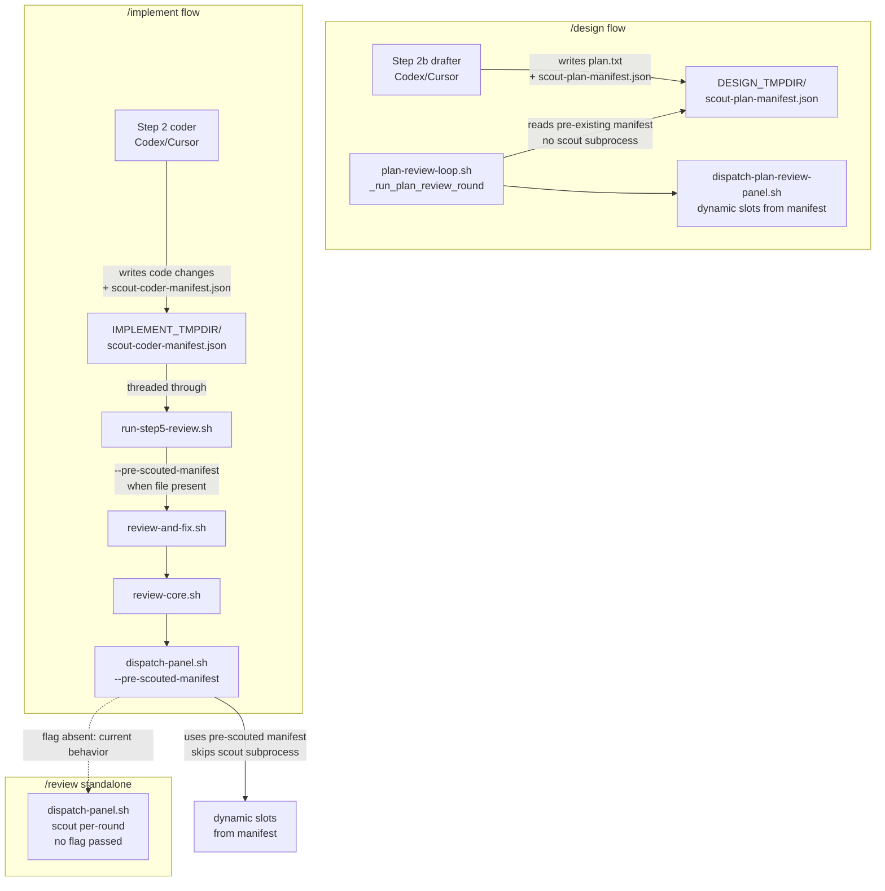

## Architecture Diagram

```mermaid
flowchart TD
    subgraph design ["/design flow"]
        D1["Step 2b drafter\nCodex/Cursor"] -->|"writes plan.txt\n+ scout-plan-manifest.json"| D2["DESIGN_TMPDIR/\nscout-plan-manifest.json"]
        D3["plan-review-loop.sh\n_run_plan_review_round"] -->|"reads pre-existing manifest\nno scout subprocess"| D2
        D3 --> D4["dispatch-plan-review-panel.sh\ndynamic slots from manifest"]
    end

    subgraph implement ["/implement flow"]
        I1["Step 2 coder\nCodex/Cursor"] -->|"writes code changes\n+ scout-coder-manifest.json"| I2["IMPLEMENT_TMPDIR/\nscout-coder-manifest.json"]
        I3["run-step5-review.sh"] -->|"--pre-scouted-manifest\nwhen file present"| I4["review-and-fix.sh"]
        I4 --> I5["review-core.sh"]
        I5 --> I6["dispatch-panel.sh\n--pre-scouted-manifest"]
        I2 -->|"threaded through"| I3
    end

    subgraph review_standalone ["/review standalone\nunchanged"]
        R1["dispatch-panel.sh\nscout per-round\nno flag passed"]
    end

    I6 -->|"uses pre-scouted manifest\nskips scout subprocess"| I7["dynamic slots\nfrom manifest"]
    I6 -.->|"flag absent: current behavior"| R1
```
