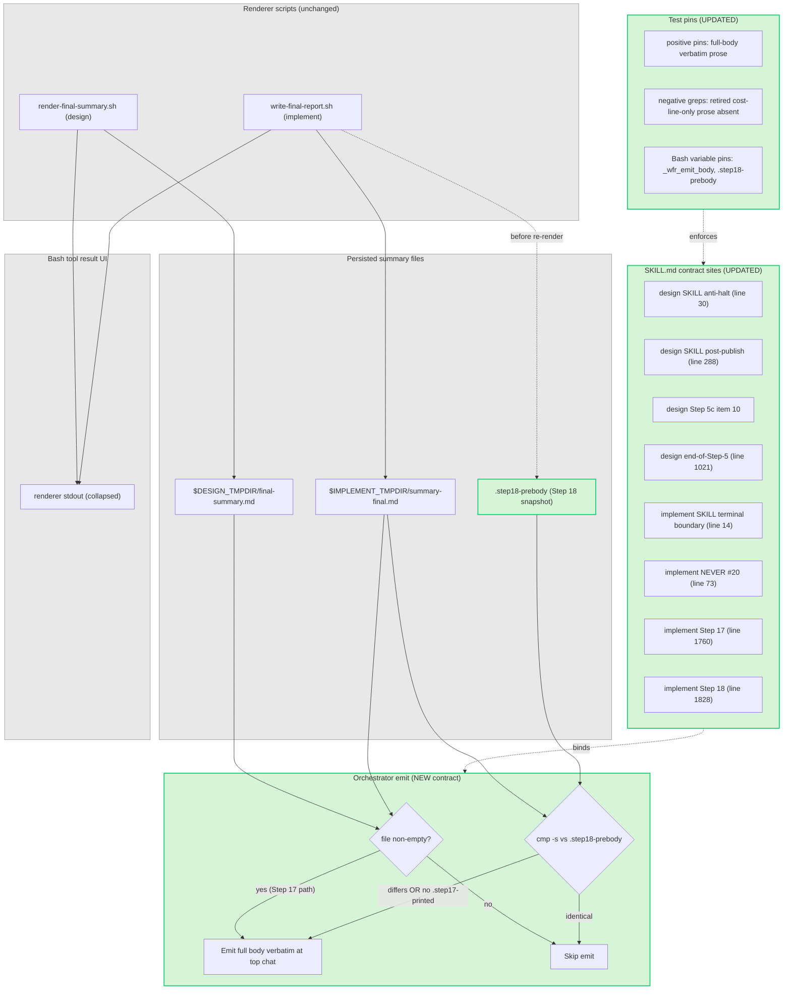

## Architecture Diagram

```mermaid
flowchart TD
    subgraph Renderer["Renderer scripts (unchanged)"]
        RFS["render-final-summary.sh (design)"]
        WFR["write-final-report.sh (implement)"]
    end

    subgraph Persistence["Persisted summary files"]
        FS["$DESIGN_TMPDIR/final-summary.md"]
        SF["$IMPLEMENT_TMPDIR/summary-final.md"]
        SNAP[".step18-prebody (Step 18 snapshot)"]
    end

    subgraph BashTool["Bash tool result UI"]
        STDOUT["renderer stdout (collapsed)"]
    end

    subgraph Orchestrator["Orchestrator emit (NEW contract)"]
        GATE{"file non-empty?"}
        EMIT["Emit full body verbatim at top chat"]
        SKIP["Skip emit"]
        CMP{"cmp -s vs .step18-prebody"}
    end

    subgraph SKILLProse["SKILL.md contract sites (UPDATED)"]
        DESIGN_ANTIHALT["design SKILL anti-halt (line 30)"]
        DESIGN_POSTPUB["design SKILL post-publish (line 288)"]
        DESIGN_ITEM10["design Step 5c item 10"]
        DESIGN_END5["design end-of-Step-5 (line 1021)"]
        IMPL_BOUNDARY["implement SKILL terminal boundary (line 14)"]
        IMPL_NEVER20["implement NEVER #20 (line 73)"]
        IMPL_STEP17["implement Step 17 (line 1760)"]
        IMPL_STEP18["implement Step 18 (line 1828)"]
    end

    subgraph Tests["Test pins (UPDATED)"]
        TESTPIN_POS["positive pins: full-body verbatim prose"]
        TESTPIN_NEG["negative greps: retired cost-line-only prose absent"]
        TESTPIN_BASH["Bash variable pins: _wfr_emit_body, .step18-prebody"]
    end

    RFS --> FS
    RFS --> STDOUT
    WFR --> SF
    WFR --> STDOUT
    WFR -.before re-render.-> SNAP

    FS --> GATE
    SF --> GATE
    GATE -- "yes (Step 17 path)" --> EMIT
    GATE -- "no" --> SKIP

    SF --> CMP
    SNAP --> CMP
    CMP -- "differs OR no .step17-printed" --> EMIT
    CMP -- "identical" --> SKIP

    SKILLProse -. binds .-> Orchestrator
    Tests -. enforces .-> SKILLProse

    classDef updated fill:#d6f5d6,stroke:#2c7,stroke-width:2px
    classDef unchanged fill:#e8e8e8,stroke:#999,stroke-width:1px
    class SKILLProse,Tests,Orchestrator,SNAP updated
    class Renderer,Persistence,BashTool unchanged
```
