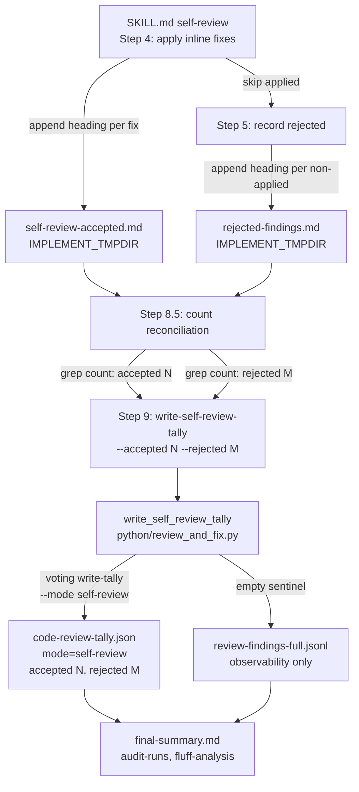

## Architecture Diagram

```mermaid
flowchart TD
    A["SKILL.md self-review\nStep 4: apply inline fixes"] -->|"append heading per fix"| B["self-review-accepted.md\nIMPLEMENT_TMPDIR"]
    A -->|"skip applied"| C["Step 5: record rejected"]
    C -->|"append heading per non-applied"| D["rejected-findings.md\nIMPLEMENT_TMPDIR"]
    B --> E["Step 8.5: count reconciliation"]
    D --> E
    E -->|"grep count: accepted N"| F["Step 9: write-self-review-tally\n--accepted N --rejected M"]
    E -->|"grep count: rejected M"| F
    F --> G["write_self_review_tally\npython/review_and_fix.py"]
    G -->|"voting write-tally\n--mode self-review"| H["code-review-tally.json\nmode=self-review\naccepted N, rejected M"]
    G -->|"empty sentinel"| I["review-findings-full.jsonl\nobservability only"]
    H --> J["final-summary.md\naudit-runs, fluff-analysis"]
    I --> J
```
