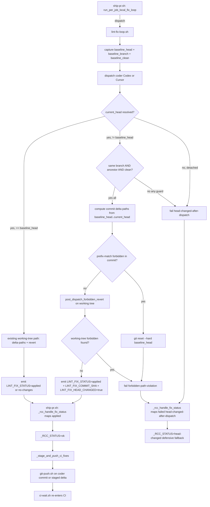

## Architecture Diagram

```mermaid
flowchart TD
    A[ship-pr.sh: run_per_job_local_fix_loop] -->|dispatch| B[lint-fix-loop.sh]
    B --> C[capture baseline_head + baseline_branch + baseline_clean]
    C --> D[dispatch coder Codex or Cursor]
    D --> E{current_head resolved?}
    E -->|no, detached| F[fail head-changed-after-dispatch]
    E -->|yes, == baseline_head| G[existing working-tree path: delta-paths + revert]
    E -->|yes, != baseline_head| H{same branch AND ancestor AND clean?}
    H -->|no any guard| F
    H -->|yes all| I[compute commit delta paths from baseline_head..current_head]
    I --> J{prefix-match forbidden in commit?}
    J -->|yes| K[git reset --hard baseline_head] --> L[fail forbidden-path-violation]
    J -->|no| M[post_dispatch_forbidden_revert on working tree]
    M --> N{working-tree forbidden found?}
    N -->|yes| L
    N -->|no| O[emit LINT_FIX_STATUS=applied + LINT_FIX_COMMIT_SHA + LINT_FIX_HEAD_CHANGED=true]
    G --> P[emit LINT_FIX_STATUS=applied or no-changes]
    O --> Q[ship-pr.sh: _rcc_handle_fix_status maps applied]
    P --> Q
    Q --> R[_RCC_STATUS=ok]
    R --> S[_stage_and_push_ci_fixes]
    S --> T[git-push.sh on coder commit or staged delta]
    T --> U[ci-wait.sh re-enters CI]
    F --> V[_rcc_handle_fix_status maps failed head-changed-after-dispatch]
    L --> V
    V --> W[_RCC_STATUS=head-changed defensive fallback]
```
